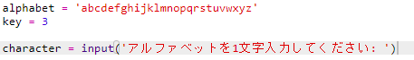
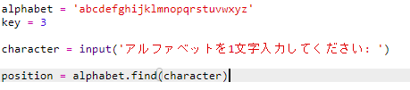
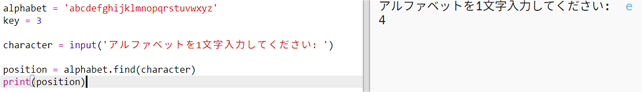
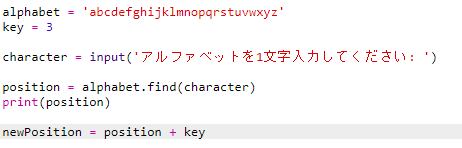
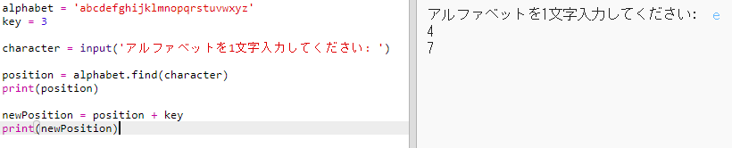
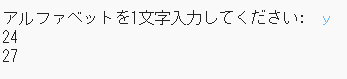
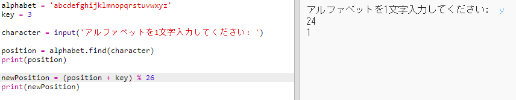
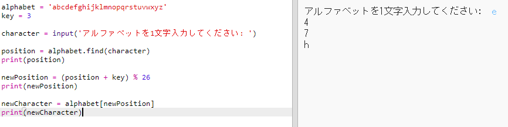
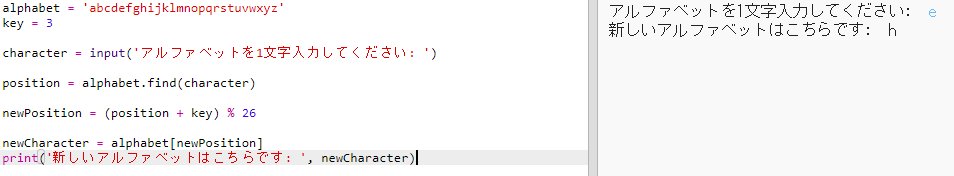

## 文字の暗号化

単一の文字を暗号化するPythonプログラムを作成しましょう。

+ ブランクのPythonテンプレートを開き <a href="http://jumpto.cc/python-new" target="_blank">。Trinket： <a href="http://jumpto.cc/python-new" target="_blank"> jumpto.cc/python-new</a>。
</li> 
    
    <li>
      

        円でアルファベットを描くのではなく、 <code>アルファベット</code> 変数として書き出しましょう。
      

      

        
      

    </li>
    
    <li>
      

        アルファベットの各文字には、位置0から始まる位置があります。したがって、文字「a」はアルファベットの位置0にあり、「c」は位置2にあります。
      

      

        
      

    </li>
    
    <li>
      

        位置を角かっこで書くことによって、 <code>アルファベット</code> 変数から手紙を得ることができます。
      

      

        
      

      

        あなたは削除することができます <code>印刷</code> あなたはこれを試してみた後、ststementsを。
      

    </li>
    
    <li>
      

        次に、秘密の <code>キー</code> を変数に格納する必要があります。
      

      

        
      

    </li>
    
    <li>
      

        次に、ユーザーに暗号化する</code>文字（ <code>文字</code>と呼ばれる）を尋ねます。
      

      

        
      

    </li>
    
    <li>
      

        <code>文字</code>の <code>位置</code> を探します。
      

      

        
      

    </li>
    
    <li>
      

        保存された <code>ポジション</code> を印刷することでテストできます。たとえば、その文字「e」は、アルファベットの4桁目にあります。
      

      

        
      

    </li>
    
    <li>
      

        <code>文字</code>を暗号化するには、 <code>キー</code> を <code>位置</code>追加する必要があります。これは <code>newPosition</code> 変数に格納されます。
      

      

        
      

    </li>
    
    <li>
      

        新しい文字位置を印刷するコードを追加します。
      

      

        
      

    </li>
    
    <li>
      

        新しいコードをテストしてください。あなたの <code>キー</code> が3であるので、 <code>位置</code> 3を加え、 <code>newPosition</code> 変数にそれを格納する必要があります。
      

      

        たとえば、文字 'e'は位置4にあります。暗号化するには、 <code>キー</code> （3）を追加して7を付けます。
      

      

        
      

    </li>
    
    <li>
      

        「y」という文字を暗号化しようとするとどうなりますか？
      

      

        
      

      

        <code>newPosition</code> が27であり、アルファベットに27文字がないことに注目してください。
      

    </li>
    
    <li>
      

        <code>％</code> を使用して、新しいポジションに、ポジション26に戻るとポジション0に戻るように指示できます。
      

      

        
      

    </li>
    
    <li>
      

        最後に、新しい位置に文字を印刷したいとします。
      

      

        たとえば、文字「e」にキーを追加すると7が、アルファベットの位置7にある文字は「h」になります。
      

      

        
      

    </li>
    
    <li>
      

        あなたのコードを試してみてください。最後に新しい文字を印刷するだけで、印刷ステートメントのいくつかを削除することもできます。
      

      

        
      

    </li></ul>