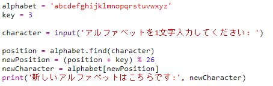
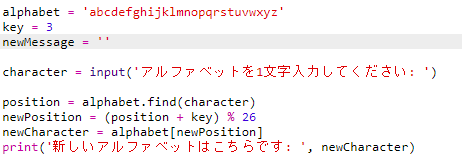
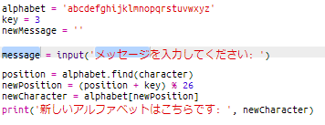
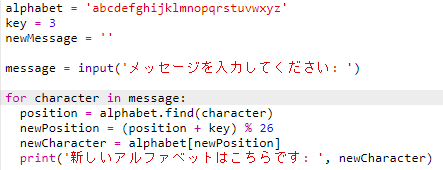
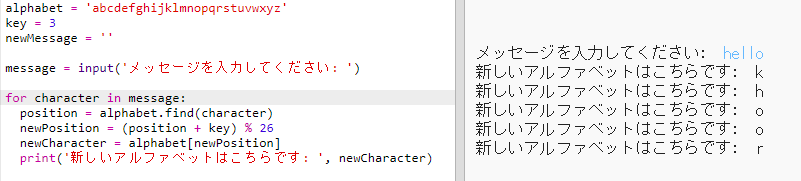
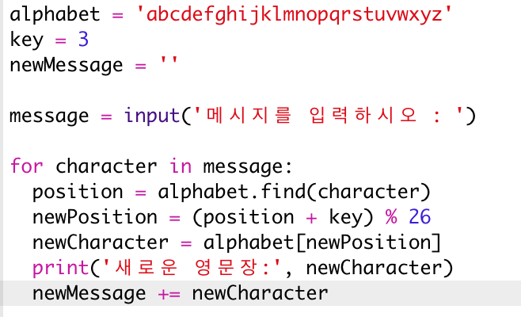
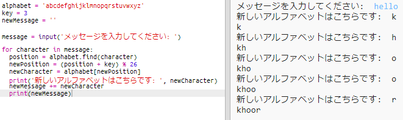
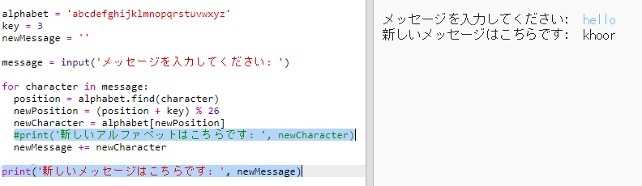

## メッセージ全体を暗号化する

メッセージを一度に1文字ずつ暗号化や復号するのではなく、メッセージ全体を暗号化するようにプログラムを変更しましょう！

+ まず、コードが次のようになっていることを確認します。
    
    

+ 新たに暗号化されたメッセージを保存する変数を作成します。
    
    

+ 1文字だけでなくユーザーのメッセージを保存するようにコードを変更します。
    
    

+ コードに`for`ループを追加して、メッセージのそれぞれの文字について繰り返すように残りのコードをインデントします。
    
    

+ コードをテストします。メッセージの各文字は暗号化され、一度に1文字ずつ表示されることがわかります。
    
    

+ 暗号化された各文字を`newMessage`（新しいメッセージ）変数に追加しましょう。
    
    

+ 暗号化しながら`newMessage`（新しいメッセージ）を`print`（表示）することができます。
    
    

+ `print`文の前にあるスペースを削除すると、暗号化されたメッセージが最後に1回だけ表示されます。文字の位置を表示するコードを削除することもできます。
    
    