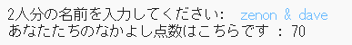
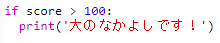

\--- challenge \---

## チャレンジ：なかよし計算機

なかよし点数を計算して、二人がどのくらい仲が良いかを示すプログラムを書きましょう。

プログラムは2つの名前にある各文字をループし、特定の文字が見つかるたびに`score`（点数）変数に得点を追加していきます。

得点を与えるルールを決めておく必要があります。たとえば、母音（ぼいん）や単語「friend」（ともだち）に含まれる文字に対して得点を与えられます。

なかよし点数に基づいて、ユーザーに個人あてのメッセージを伝えることもできます。

\--- /challenge \---