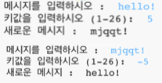

## 들어가며:

이 프로젝트에서는 자신만의 암호화 프로그램을 만들고, 친구와 비밀 메시지를 주고받는 방법을 배웁니다. 

<div class="trinket">
  <iframe src="https://trinket.io/embed/python/402256078c?outputOnly=true&start=result" width="600" height="500" frameborder="0" marginwidth="0" marginheight="0" allowfullscreen>
  </iframe>
  
</div>

### 교육자들을 위한 추가 정보

이 프로젝트를 인쇄하려면 [인쇄용 문서](https://projects.raspberrypi.org/en/projects/secret-messages/print)를 사용하십시오.

## \--- collapse \---

## 제목: 교육자 노트

## 들어가며:

이 프로젝트에서 아이들은 암호화 프로그램을 만들고 친구와 비밀 메시지를 보내고 받는 법을 배웁니다. 이 프로젝트에서 텍스트 문자열의 반복(루프)에 대해 소개합니다.

## 온라인 자료들

**이 프로젝트는 파이썬3를 사용합니다.** 파이썬 코드를 온라인에서 작성하기 위해 [Trinket](https://trinket.io/)을 사용하는것을 추천합니다. 이 프로젝트는 다음 Trinket을 포함합니다:

* [새로운(비어있는) 파이썬 Trinket -- jumpto.cc/python-new](http://jumpto.cc/python-new)

완성된 프로젝트를 포함한 Trinket도 있습니다:

* ['비밀 메시지' 완성본 -- trinket.io/python/402256078c](https://trinket.io/python/402256078c)

* ['우정 계산기' 완성본 -- trinket.io/python/2e852cd687](https://trinket.io/python/2e852cd687)

## 오프라인 자료

선호에따라 프로젝트를 [오프라인으로 완성](https://www.codeclubprojects.org/en-GB/resources/python-working-offline/)할 수 있습니다.

완성된 프로젝트는 '자원 봉사자 자원' 섹션에서 찾을 수 있으며, 다음의 파일들을 포함합니다.

* messages-finished/messages.py
* messages-finished/friends.py

(또한 위의 모든 자료는 프로젝트 및 자원봉사자 `.zip` 파일로 다운로드 할 수 있습니다.)

## 학습 목표

* 문자열 변수에 대한 반복 (루핑)
* `find()` 메소드
* 나머지 계산 기호(`%`)

이 프로젝트는 [라즈베리파이 디지털 메이킹 커리큘럼](http://rpf.io/curriculum) 중 아래의 과정에 있는 요소들을 다룹니다.

* [프로그래밍 구조를 결합하여 문제 해결하기](https://www.raspberrypi.org/curriculum/programming/builder)

## 도전과제

* 카이사르 암호 사용해보기 - 문자와 단어를 직접 암호화하고 해독합니다.
* 변수 키 - 사용자가 선택한 키를 입력할 수 있게 합니다.
* 메시지 암호화 하고 해독하기 - 전체 메시지를 암호화하고 해독합니다.
* 우정 계산기 - 텍스트 반복을 새로운 문제에 적용해봅니다.

## 자주 물어보는 질문

* `find()`를 사용하여 검색하거나 `알파벳이 char 인 경우: ` 검색은 대소 문자를 구분합니다. 아이들은 다음을 사용할 수 있습니다:
    
    ```python
    message = input ( "Please enter a message to encrypt: ").lower ()
    ```
    
    위의 코드를 통해 검색할 문자의 입력값을 소문자로 만듭니다.

\--- /collapse \---

## \--- collapse \---

## 제목: 프로젝트 자료

## 프로젝트 리소스

* [프로젝트의 모든 리소스가 들어있는 .zip 파일](resources/secret-messages-project-resources.zip)
* [온라인 파이썬 공백 Trinket 창](http://jumpto.cc/python-new)
* [오프라인 파이썬 공백 파일](resources/new-new.py)

## 교육자를 위한 자료

* [완성된 모든 프로젝트 리소스가 들어있는 .zip 파일](resources/secret-messages-volunteer-resources.zip)
* [완성된 온라인 Trinket 프로젝트](https://trinket.io/python/402256078c)
* [secret-messages-finished/messages.py](resources/secret-messages-finished-messages.py)
* [완성된 온라인 '우정 계산기' 과제](https://trinket.io/python/2e852cd687)
* [완성된 오프라인 '우정 계산기' 과제](resources/friendship-calculator-finished-friends.py)

\--- /collapse \---