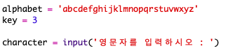
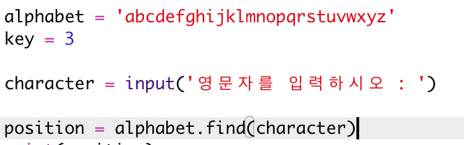
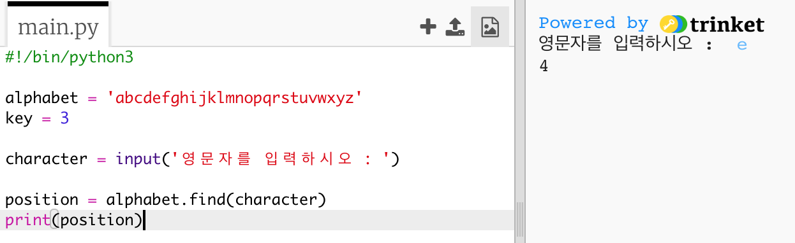
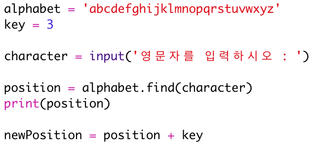
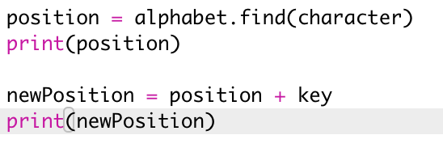
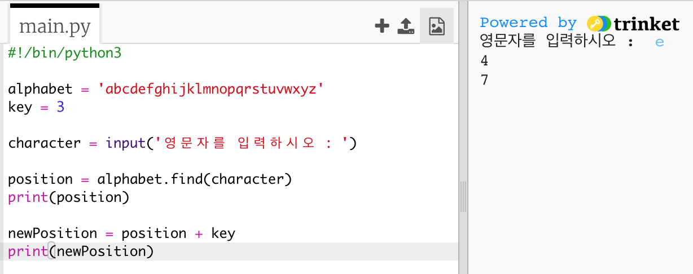
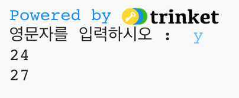
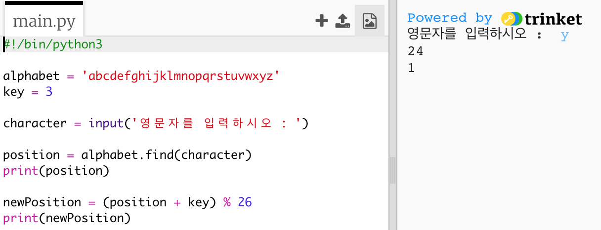
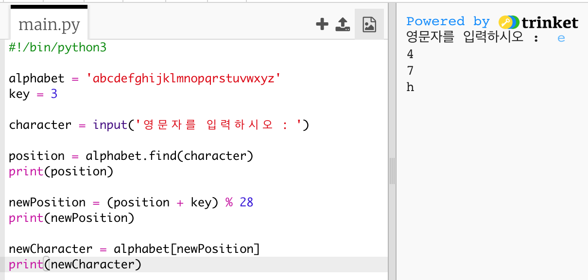
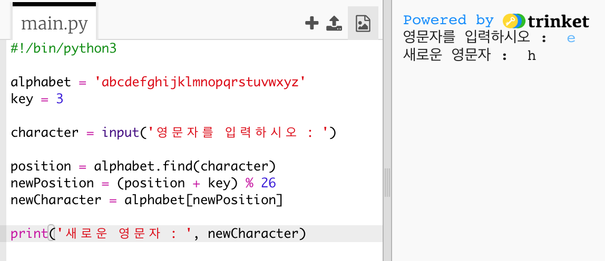

## 글자 암호화하기

단일 문자를 암호화하는 파이썬 프로그램을 작성해 보겠습니다.

+ 공백의 파이썬 Trinket 템플릿을 엽니다. <a href="http://jumpto.cc/python-new" target="_blank"> jumpto.cc/python-new </a>

+ 원안에 알파벳을 그리는 대신 `알파벳`변수로 써 봅시다.
    
    

+ 알파벳의 각 문자는 위치 0부터 시작하여 위치를 가집니다. 따라서 문자 'a'는 알파벳의 위치 0에 있고 'c'는 위치 2에 있습니다.
    
    

+ 대괄호로 안에 위치를 적어 넣음으로써 `알파벳`변수의 문자를 얻을 수 있습니다.
    
    
    
    위의 시도를 마치고 난 경우라면, `print`문을 삭제해도 괜찮습니다.

+ 다음으로 비밀 `키`를 변수에 저장해야합니다.
    
    

+ 다음으로 사용자에게 (`character` 라 불리는) 단일 문자를 사용하여 암호화합니다.
    
    

+ `문자`의 `위치`를 찾습니다.
    
    

+ 그것을 출력하여 저장된 `위치`를 테스트 할 수 있습니다. 예를 들어, 문자 'e'는 알파벳 4의 위치에 있습니다.
    
    

+ `문자`를 암호화하기 위해서는 `위치`에 추가해야합니다. 그 뒤에 `newPosition` 변수에 저장됩니다.
    
    

+ 새로운 문자 위치를 출력하는 코드를 추가하십시오.
    
    

+ 새 코드를 테스트하십시오. 여러분의 `키`가 3이므로 `위치`에 3을 더합니다. 그리고 `newPosition`변수에 저장합니다.
    
    예를 들어, 문자 'e'는 위치 4에 있습니다. 암호화하려면 7에 해당하는 `키`(3)을 추가하십시오 ,
    
    

+ 문자 'y'를 암호화하면 어떻게 됩니까?
    
    
    
    어떻게 `newPosition` 변수가 27이 되고, 알파벳 안에 27자가 안되는 것을 확인하십시오.

+ 당신은 `%`를 사용하여 새 위치가 26에 도달하면 포지션 0으로 되돌아 가도록 지시할 수 있습니다.
    
    

+ 마지막으로, 새 위치에 편지를 출력할 수 있습니다.
    
    예를 들어, 문자 'e' 에 키를 추가하면 7이 되고, 알파벳 7의 문자는 'h'가됩니다.
    
    

+ 코드를 시험해보십시오. 끝부분에 새 문자를 출력하기만 하면 인쇄 문을 일부 제거할 수도 있습니다.
    
    