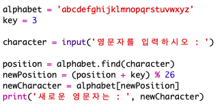
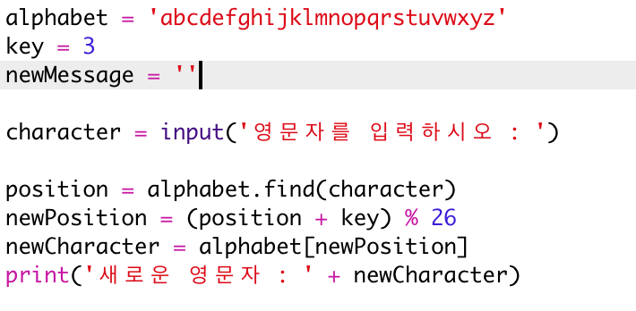
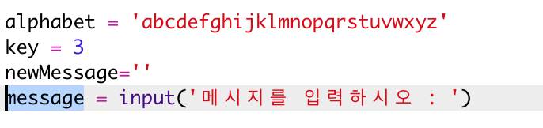
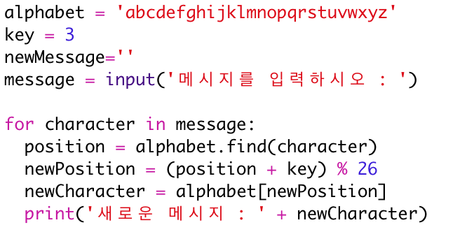
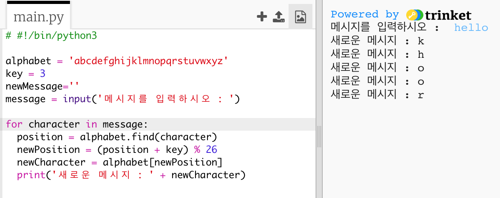
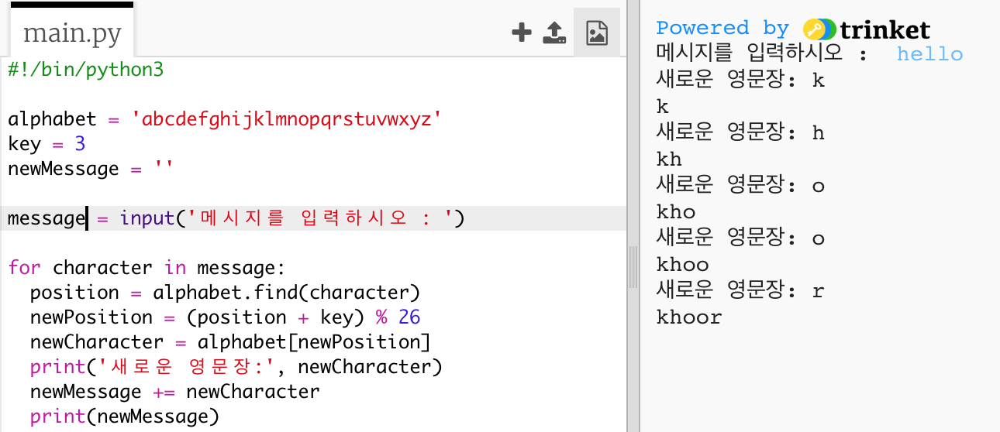
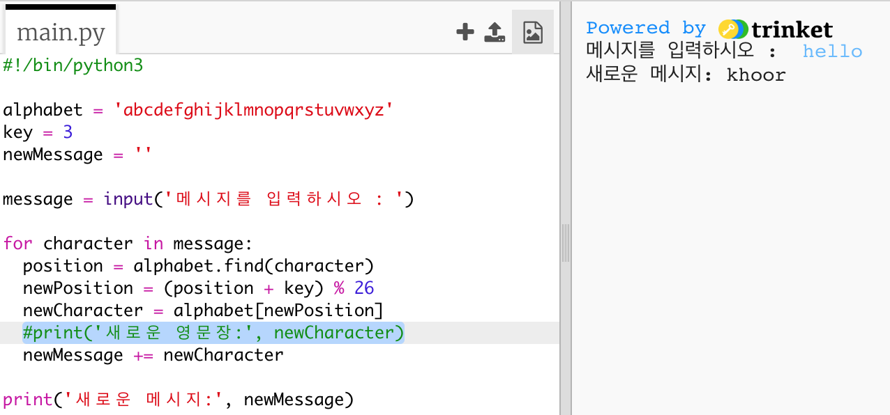

## 전체 메시지를 암호화하기

한 번에 하나의 문자를 암호화하고 암호를 해독하는 대신 프로그램을 변경하여 전체 메시지를 암호화하십시오!

+ 먼저 코드를 다음과 같은 확인하십시오:
    
    

+ 암호화된 새 메시지를 저장할 변수를 만듭니다.
    
    

+ 한 문자 만이 아니라 사용자의 메시지를 저장하도록 코드를 변경하십시오.
    
    

+ `for`루프를 코드에 추가하고 나머지 코드를 들여 쓰기 하여 메시지의 각 문자에 대해 반복되도록 하십시오.
    
    

+ 코드를 테스트하십시오. 메시지의 각 문자가 암호화되어 한 번에 하나씩 출력됩니다.
    
    

+ 암호화된 각 문자를 `newMessage` 변수에 추가해 봅시다.
    
    

+ `newMessage`를 암호화의 시작과 동시에 `출력`할 수 있습니다. 
    
    

+ `print`문 전에 공백을 삭제하면, 암호화된 메시지는 끝에 한 번만 표시됩니다. 문자 위치 출력 코드를 삭제할 수도 있습니다.
    
    