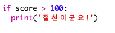

\--- challenge \---

## 도전과제: 우정 계산기

우정 점수를 계산하여 2 명의 사이가 얼마나 좋은지 보여주는 프로그램을 작성하십시오.

프로그램은 2개의 이름에 있는 각 문자에 대해 반복할 수 있고 특정 문자가 발견될 때마다 `score`변수에 포인트를 추가할 수 있습니다.

포인트 지급을 위한 규칙을 결정해야합니다. 예를 들어, "친구" 라는 단어가 발견된 모음 또는 문자에 대해 점수를 부여 할 수 있습니다.

점수에 따라 사용자에게 맞춤 메시지를 보내줄 수도 있습니다.

\--- /challenge \---