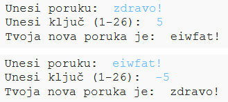

## Uvod:

U ovom projektu naučićeš kako da napraviš sopstveni program za šifrovanje koji ćeš koristiti za razmjenjivanje tajnih poruka sa prijateljem. Ovaj projekat povezan je sa aktivnošću ''Earth to Principia" koja se nalazi na stranici 16 veb-sajta Space Diary (Svemirski dnevnik).

<div class="trinket">
  <iframe src="https://trinket.io/embed/python/943ef49e47?outputOnly=true&start=result" width="600" height="500" frameborder="0" marginwidth="0" marginheight="0" allowfullscreen>
  </iframe>
  
</div>

### Dodatne informacije za vođe kluba

Ukoliko je potrebno da odštampate ovaj projekat, koristite [Verziju za štampu](https://projects.raspberrypi.org/me-ME/projects/secret-messages/print).

--- collapse ---
---
title: Bilješke za vođe kluba
---
## Uvod:

U ovom projektu djeca će naučiti kako da naprave program za šifrovanje pomoću kojeg će razmjenjivati tajne poruke sa prijateljem. U projektu je predstavljena iteracija (ponavljanje u petlji) nad tekstualnim nizom.

## Online izvori

**U ovom projektu koristi se Python 3.** Preporučujemo korišćenje [trinketa](https://trinket.io/) za online pisanje u Pythonu. Projekat sadrži sljedeće Trinkete:

* [Novi (prazan) Python Trinket -- jumpto.cc/python-new](http://jumpto.cc/python-new)

Takođe postoji trinket koji sadrži završen projekat:

* [Završen projekat 'Tajne poruke' -- trinket.io/python/943ef49e47](https://trinket.io/python/943ef49e47)

* [Završen izazov 'Kalkulator prijateljstva' -- trinket.io/python/9cdf7d919f](https://trinket.io/python/9cdf7d919f)

## Offline izvori

Ako želite, ovaj projekat može biti [izrađen offline](https://www.codeclubprojects.org/en-GB/resources/python-working-offline/).

Završenu verziju projekta možete naći u odjeljku 'Izvori za volontere' koji sadrži:

* messages-finished/messages.py
* messages-finished/friends.py

(Sve navedene izvore moguće je preuzeti kao `.zip` datoteke.)

## Ciljevi učenja

* Iteracija (ponavljanje u petlji) nad promjenljivom niza;
* Metod `find()`;
* Modulo operator (`%`).

Ovim projektom obuhvaćeni su elementi iz sljedećih dijelova [Raspberry Pi Digital Making Curriculum](https://rpf.io/curriculum):

* [Kombinujte programske konstrukcije za rješavanje problema.](https://www.raspberrypi.org/curriculum/programming/builder)

## Izazovi

* Isprobaj Cezarovu šifru - ručno šifruj i dešifruj slova i riječi;
* Promjenljivi ključevi - omogući korisniku da unese odabrani ključ;
* Šifrovanje i dešifrovanje poruka - šifrovanje i dešifrovanje cijelih poruka;
* Kalkulator prijateljstva - primjena iteracije nad tekstom na novi problem.

## Često postavljana pitanja

* Prilikom pretraživanja pomoću `find()` ili `if char in alphabet:` imajte u vidu da pretrage razlikuju velika i mala slova. Djeca mogu da koriste:
    
    ```python
    poruka = input("Unesi poruku za šifrovanje: ").lower()
    ```
    
    kako bi unos bio napisan malim slovima prije pretraživanja.

--- /collapse ---

--- collapse ---
---
title: Projektni materijali
---
## Izvori projekta

* [.zip datoteka koja sadrži sve izvore projekta](resources/secret-messages-project-resources.zip)
* [Online prazan Python Trinket](http://jumpto.cc/python-new)
* [Offline prazna Python datoteka](resources/new-new.py)

## Izvori za vođe kluba

* [.zip datoteka koja sadrži sve završene izvore projekta](resources/secret-messages-volunteer-resources.zip)
* [Završen Trinket projekat online](https://trinket.io/python/943ef49e47)
* [secret-messages-finished/messages.py](resources/secret-messages-finished-messages.py)
* [Završen izazov 'Kalkulator prijateljstva' online](https://trinket.io/python/9cdf7d919f)
* [Završen izazov 'Kalkulator prijateljstva' offline](resources/friendship-calculator-finished-friends.py)

--- /collapse ---