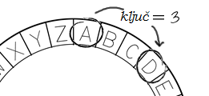

## Cezarova šifra

Šifra je vrsta tajnog kôda u kojem zamjenjuješ slova tako da niko ne može da pročita tvoju poruku.

Koristićeš **Cezarovu šifru**, jednu od najstarijih i najpoznatijih šifri koja je nazvana po Juliju Cezaru.

Prije nego što počnemo da kodiramo, pokušajmo da sakrijemo riječ koristeći Cezarovu šifru.

+ Sakrivanje riječi naziva se **šifrovanje**.
    
    Počnimo sa šifrovanjem slova 'a'. Da bismo to uradili, možemo da nacrtamo abecedu u krugu, kao što je ova:
    
    

+ Da od običnog slova napraviš tajno šifrovano slovo, moraš imati tajni ključ. Koristićemo broj 3 kao ključ (možeš koristiti i bilo koji drugi broj).
    
    Za **šifrovanje** slova 'a', samo se pomjeri za 3 slova u smjeru kazaljke na satu i tako ćeš dobiti slovo 'd':
    
    

+ Možeš da iskoristiš naučeno za šifrovanje cijele riječi. Na primjer, kada šifrujemo riječ 'hello' dobićemo 'khoor'. Pokušaj.
    
    + h + 3 = **k**
    + e + 3 = **h**
    + l + 3 = **o**
    + l + 3 = **o**
    + o + 3 = **r**

+ Vraćanje teksta u početni oblik naziva se **dešifrovanje**. Za dešifrovanje riječi, jednostavno oduzmi ključ umjesto da ga dodaš:
    
    + k - 3 = **h**
    + h - 3 = **e**
    + o - 3 = **l**
    + o - 3 = **l**
    + r - 3 = **o**