## Šifrovanje slova

Napišimo Python program za šifrovanje jednog znaka.

+ Otvori prazan Python šablon u Trinketu: <a href="http://jumpto.cc/python-new" target="_blank">jumpto.cc/python-new</a>.

+ Umjesto da crtamo abecedu u krugu, napišimo je kao promjenljivu `abeceda`.
    
    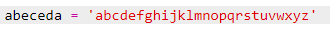

+ Svako slovo abecede ima svoju poziciju, počevši od pozicije 0. Dakle, slovo 'a' je na poziciji 0 abecede, a 'c' je na poziciji 2.
    
    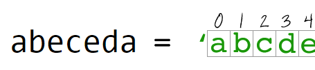

+ Možeš da ispišeš slovo koje se nalazi u promjenljivoj `abeceda` tako što ćeš upisati njegovu poziciju unutar uglastih zagrada.
    
    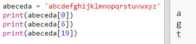
    
    Kada ovo isprobaš, možeš da izbrišeš naredbe `print`.

+ Zatim treba da sačuvaš tajni `ključ` u promjenljivoj.
    
    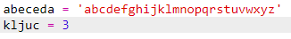

+ Sada pitaj korisnika da unese jedno slovo (odnosno `znak`) koji će biti šifrovan.
    
    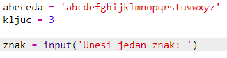

+ Pronađi `poziciju` tog `znaka`.
    
    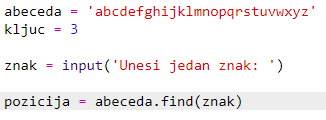

+ Možeš da isprobaš sačuvanu `poziciju` tako što ćeš je ispisati. Na primjer, provjeri da li je znak 'e' na poziciji 4 u abecedi.
    
    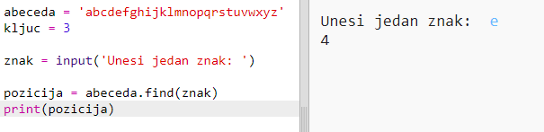

+ Za šifrovanje `znaka` treba `poziciji` da dodaš `ključ`. Zatim to sačuvaj u promjenljivoj `novaPozicija`.
    
    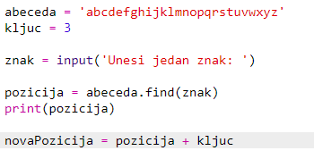

+ Dodaj kôd kojim ćeš ispisati novu poziciju znaka.
    
    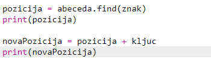

+ Isprobaj svoj novi kôd. Pošto je tvoj `ključ` broj 3, `poziciji` bi trebalo da bude dodat broj 3, a zatim sačuvan u tvojoj promjenljivoj `novaPozicija`.
    
    Na primjer, slovo 'e' je na poziciji 4. Da ga šifruješ, dodaješ `ključ` (3), što daje 7.
    
    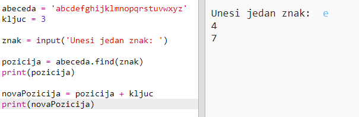

+ Šta se dešava kada pokušaš da šifruješ slovo 'y'?
    
    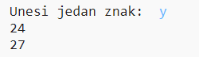
    
    Primjećuješ li da je `novaPozicija` 27, a u engleskoj abecedi nema 27 slova!

+ Možeš da koristiš `%` kako bi se nova pozicija, nakon što dođe do pozicije 26, vratila na poziciju 0.
    
    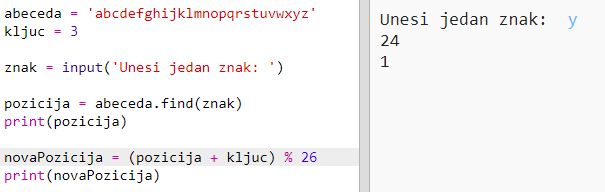

+ Na kraju, želimo da ispišemo slovo koje se nalazi na novoj poziciji.
    
    Na primjer, kada dodamo ključ slovu 'e' dobićemo 7, a slovo koje se nalazi na poziciji 7 u abecedi je 'h'.
    
    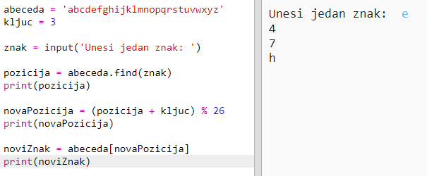

+ Isprobaj svoj kôd. Možeš i da ukloniš neke od svojih print naredbi i da ispišeš samo novi znak na kraju.
    
    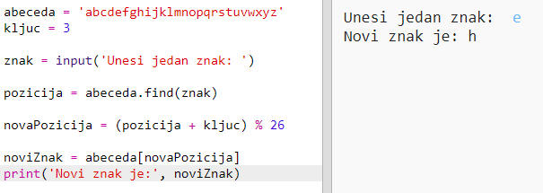