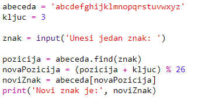
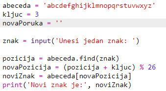
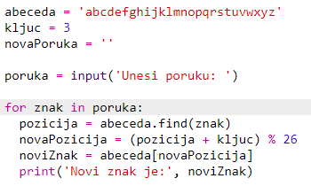
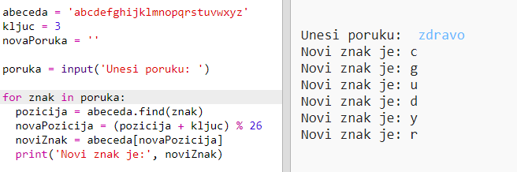
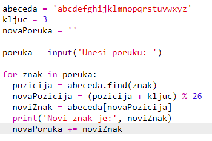
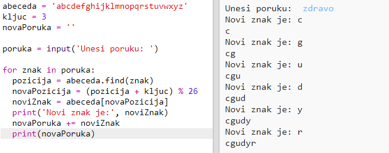

## Šifrovanje cijelih poruka

Podesimo program da šifruje cijele poruke, umjesto da šifruje i dešifruje jedan po jedan znak!

+ Prvo provjeri da li tvoj kôd izgleda ovako:
    
    

+ Kreiraj promjenljivu u kojoj ćeš sačuvati novu šifrovanu poruku.
    
    

+ Izmijeni svoj kôd tako da sačuva korisnikovu poruku, a ne samo jedan znak.
    
    

+ Svom kôdu dodaj `for` petlju, a zatim uvuci ostatak kôda kako bi se ponavljao za svaki znak poruke.
    
    

+ Isprobaj svoj kôd. Trebalo bi da se znakovi poruke šifruju i ispisuju jedan po jedan.
    
    

+ Dodajmo svaki šifrovani znak u promjenljivu `novaPoruka`.
    
    

+ Koristeći naredbu `print`, možeš da ispišeš promjenljivu `novaPoruka` dok se šifruje.
    
    

+ Ako izbrišeš razmake prije naredbe `print`, šifrovana poruka biće prikazana samo jednom na kraju. Možeš da izbrišeš i kôd za ispisivanje pozicija znakova.
    
    