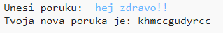
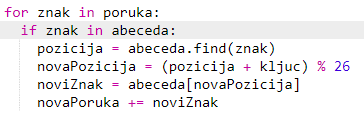
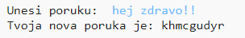
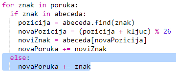
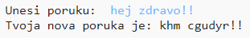

## Dodatni znakovi

Neki znakovi se ne nalaze u abecedi, što uzrokuje grešku.

+ Isprobaj svoj kôd koristeći nekoliko znakova koji se ne nalaze u abecedi.
    
    Na primjer, možeš da upotrijebiš poruku `hej zdravo!!`.
    
    
    
    Primijetićeš da su razmak i znak uzvika `!` šifrovani kao slovo 'c'!

+ Da bismo to popravili, program treba da šifruje znak samo ako se nalazi u abecedi. To ćeš napraviti tako što ćeš svom kôdu dodati `if` naredbu, a ostatak kôda uvući.
    
    

+ Isprobaj svoj kôd koristeći istu poruku. Šta se dešava ovaj put?
    
    
    
    Sada tvoj kôd jednostavno preskače svaki znak koji se ne nalazi u abecedi.

+ Najbolje bi bilo da tvoj kôd ne šifruje znakove koji nisu u abecedi, već jednostavno koristi izvorni znak.
    
    Svom kôdu dodaj `else` naredbu koja će dodati izvorni znak šifrovanoj poruci.
    
    

+ Isprobaj svoj kôd. Trebalo bi da svi znakovi abecede budu šifrovani, a ostali znakovi da budu u svom izvornom obliku!
    
    