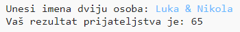
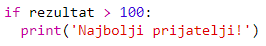

--- challenge ---

## Izazov: Kalkulator prijateljstva

Napiši program koji će, računanjem bodova prijateljstva, pokazivati koliko dvije osobe odgovaraju jedna drugoj.

Program može da prođe kroz svaki od znakova koji se nalaze u dva imena i da, svaki put kada pronađe odgovarajuće slovo, doda bodove u promjenljivu `rezultat`.

Treba da odrediš pravila za dodjeljivanje bodova. Na primjer, možeš da dodijeliš bodove za samoglasnike ili za znakove koji se nalaze u riječi ''prijatelj'':

Korisnicima možeš prikazati i posebnu poruku, u zavisnosti od njihovog rezultata:

--- /challenge ---