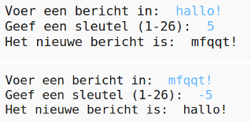

## Inleiding

In dit project leer je hoe je je eigen coderingsprogramma maakt, om met een vriend geheime berichten te verzenden en ontvangen. This project ties in with the "Earth to Principia" activity on page 16 of the Space Diary.

<div class="trinket">
  <iframe src="https://trinket.io/embed/python/402256078c?outputOnly=true&start=result" width="600" height="500" frameborder="0" marginwidth="0" marginheight="0" allowfullscreen>
  </iframe>
  
</div>

### Aanvullende informatie voor clubleiders

Als je dit project wilt afdrukken, gebruik dan de [printervriendelijke versie](https://projects.raspberrypi.org/en/projects/secret-messages/print).

## \--- collapse \---

## title: Clubleider notities

## Inleiding:

In dit project leren kinderen een encryptieprogramma te maken, om geheime berichten met een vriend te verzenden en ontvangen. Dit project introduceert iteratie (herhaling, met lussen of 'loops') over een tekenreeks.

## Online bronnen

**Dit project maakt gebruik van Python 3.** We raden aan om [trinket](https://trinket.io/) te gebruiken om Python online te schrijven. Dit project bevat de volgende Trinkets:

* [Nieuwe (lege) Python Trinket - jumpto.cc/python-new](http://jumpto.cc/python-new)

Er is ook een trinket met het voltooide project:

* ['Geheime berichten' voltooid - trinket.io/python/402256078c](https://trinket.io/python/402256078c)

* ['Vriendschapscalculator' gereed - trinket.io/python/2e852cd687](https://trinket.io/python/2e852cd687)

## Offline bronnen

Dit project kan [offline worden voltooid](https://www.codeclubprojects.org/en-GB/resources/python-working-offline/) als dit de voorkeur heeft.

Je kunt een voltooide versie van dit project vinden in de sectie 'Vrijwilligersbronnen', die het volgende bevat:

* messages-finished/messages.py
* messages-finished/friends.py

(Alle bovenstaande bronnen kunnen ook worden gedownload als project en als vrijwilliger `.zip` bestanden.)

## Leerdoelen

* Iteratie (lusvorming of looping) over een stringvariabele;
* De methode `find()`;
* De modulus-operator (`%`).

Dit project behandelt elementen uit de volgende onderdelen van het [Raspberry Pi Digital Making Curriculum](http://rpf.io/curriculum):

* [Combineer programmeerconstructies om een ​​probleem op te lossen.](https://www.raspberrypi.org/curriculum/programming/builder)

## Uitdagingen

* Use a Caesar cipher - encrypt and decrypt letters and words manually;
* Variabele sleutels - laat de gebruiker een gekozen sleutel invoeren;
* Berichten coderen en decoderen - versleutelen en ontcijferen van hele berichten;
* Vriendschapscalculator - tekst-iteratie toepassen op een nieuw probleem.

## Veel Gestelde Vragen

* Bij het zoeken met `find()` of `als teken in alfabet:`, merk je dat zoekopdrachten hoofdlettergevoelig zijn. Kinderen kunnen het volgende gebruiken:
    
    ```python
    bericht = input ("Voer een bericht in om te coderen:").lower()
    ```
    
    om de invoer in kleine letters te zetten voordat er wordt gezocht.

\--- /collapse \---

## \--- collapse \---

## title: Projectmaterialen

## Projectbronnen

* [.zip-bestand met alle projectbronnen](resources/secret-messages-project-resources.zip)
* [Online lege Python Trinket](http://jumpto.cc/python-new)
* [Offline leeg Python-bestand](resources/new-new.py)

## Clubleiderbronnen

* [.zip-bestand met alle voltooide projectresources](resources/secret-messages-volunteer-resources.zip)
* [Online voltooid Trinket-project](https://trinket.io/python/402256078c)
* [secret-messages-finished/messages.py](resources/secret-messages-finished-messages.py)
* [Online voltooide uitdaging 'Vriendschapscalculator'](https://trinket.io/python/2e852cd687)
* [Offline voltooide uitdaging 'Vriendschapscalculator'](resources/friendship-calculator-finished-friends.py)

\--- /collapse \---