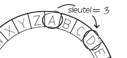

## Het Caesarcijfer

Een versleuteling is een soort geheimschrift, waarbij je de letters omwisselt zodat niemand je bericht kan lezen.

Je gaat een van de oudste en meest bekende versleutelingen gebruiken, het **Caesarcijfer**, genoemd naar Julius Caesar.

Voordat we gaan coderen, proberen we het Caesarcijfer te gebruiken om een ​​woord te verbergen.

+ Het verbergen van een woord wordt **codering of encryptie** genoemd.
    
    We beginnen met het coderen van de letter 'a'. Om dit te doen, kunnen we het alfabet in een cirkel tekenen, zoals hier:
    
    

+ Als je van een normale letter een geheime gecodeerde wilt maken, moet je een geheime sleutel hebben. Laten we het getal 3 als sleutel gebruiken (maar je kunt elk ander getal gebruiken).
    
    Om de letter 'a' te **versleutelen**, verplaats je 3 letters rechtsom, wat de letter 'd' geeft:
    
    

+ Je kunt dit gebruiken om een ​​heel woord te versleutelen. 'hallo' is bijvoorbeeld 'khoor' na versleuteling. Probeer het zelf.
    
    + h + 3 = **k**
    + a + 3 = **d**
    + l + 3 = **o**
    + l + 3 = **o**
    + o + 3 = **r**

+ Tekst terugzetten naar een leesbare versie wordt **decodering of decryptie** genoemd. Om een ​​woord te decoderen, trek je de sleutel af in plaats van het op te tellen:
    
    + k - 3 = **h**
    + d - 3 = **a**
    + o - 3 = **l**
    + o - 3 = **l**
    + r - 3 = **o**