## Letters coderen

We gaan een Python-programma schrijven om een ​​enkel teken te coderen.

+ Open de lege Python-sjabloon Trinket: <a href="http://jumpto.cc/python-new" target="_blank">jumpto.cc/python-new</a>.

+ In plaats van het alfabet in een cirkel te tekenen, gaan we het opschrijven als een variabele `alfabet`.
    
    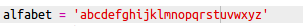

+ Elke letter van het alfabet heeft een plaats, beginnend bij positie 0. Dus staat de letter 'a' op positie 0 van het alfabet en staat 'c' op positie 2.
    
    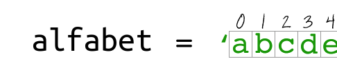

+ Je kunt een letter uit de variabele ` alfabet` krijgen door de positie tussen vierkante haken te zetten.
    
    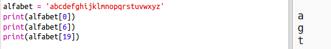
    
    You can delete the `print` statements once you've tried this out.

+ Nu moet je de geheime `sleutel` in een variabele opslaan.
    
    

+ Vraag de gebruiker een letter (ook `teken` genoemd) om te coderen.
    
    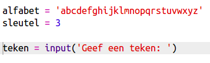

+ Zoek de `positie` van het `teken`.
    
    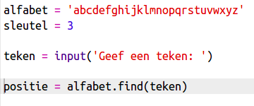

+ Je kunt de opgeslagen `positie` testen door die te laten zien. Bijvoorbeeld, dat karakter 'e' op positie 4 in het alfabet staat.
    
    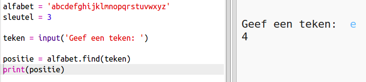

+ Als je het `teken` wilt coderen, moet je de `sleutel` toevoegen aan de `positie`. Dit wordt dan opgeslagen in een variabele `nieuwePositie`.
    
    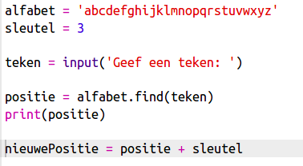

+ Voeg code toe om de nieuwe positie van het teken te laten zien.
    
    

+ Test de nieuwe code. Omdat de `sleutel` 3 is, moet er 3 worden toegevoegd aan de `positie` en worden opgeslagen in de `nieuwePositie` variabele.
    
    De letter 'e' staat bijvoorbeeld op positie 4. Om te coderen, voeg je de `sleutel` (3) toe, wat 7 oplevert.
    
    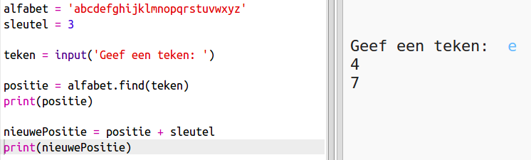

+ Wat gebeurt er als je de letter 'y' probeert te versleutelen?
    
    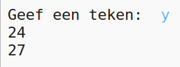
    
    Je ziet dat `nieuwePositie` 27 is en er zijn geen 27 letters in het alfabet!

+ Je kunt een `%` gebruiken om terug te gaan naar positie 0 zodra deze op positie 26 komt.
    
    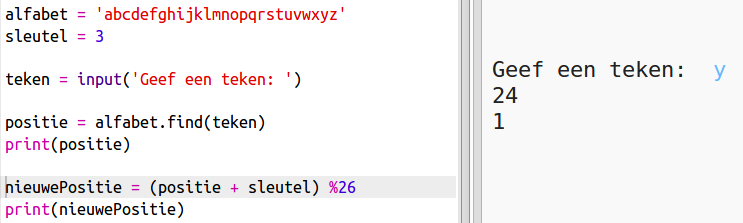

+ Tot slot wil je de letter op de nieuwe positie weergeven.
    
    Bijvoorbeeld, het toevoegen van de sleutel aan de letter 'e' geeft 7, en de letter op positie 7 van het alfabet is 'h'.
    
    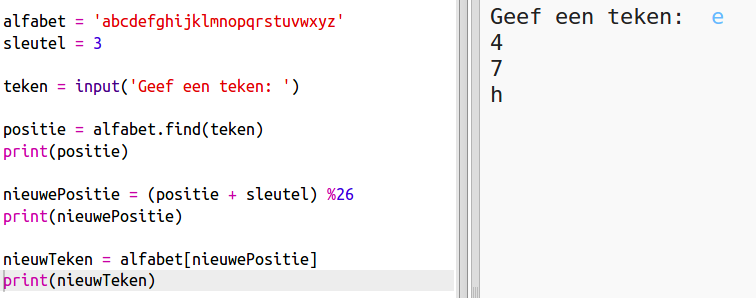

+ Probeer de code uit. Je kunt ook enkele printinstructies weglaten zodat alleen het nieuwe teken aan het einde wordt weergegeven.
    
    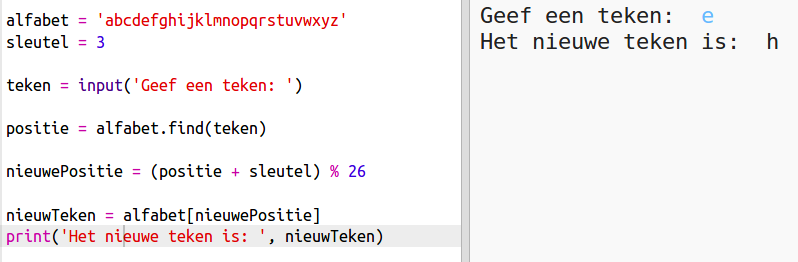