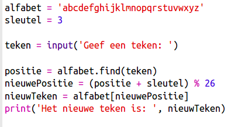
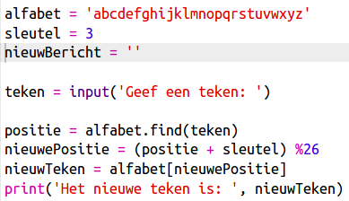
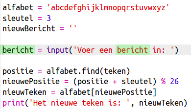
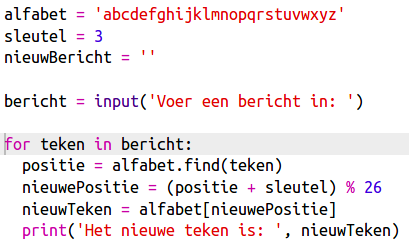
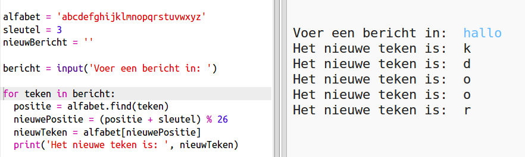
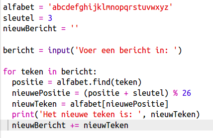
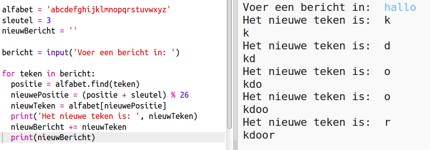
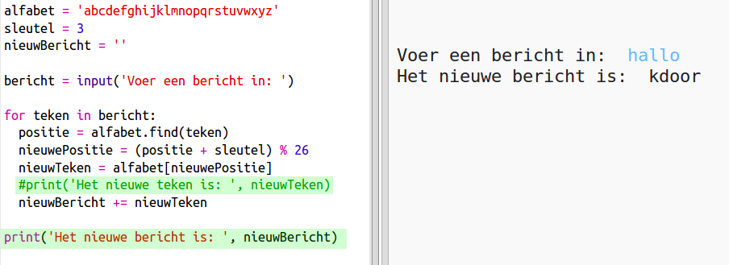

## Hele berichten versleutelen

In plaats van het per teken versleutelen van berichten, kunnen we het programma zo aanpassen dat het hele bericht wordt gecodeerd.

+ Kijk eerst of de code er zo uitziet:
    
    

+ Maak een variabele waarin het nieuwe gecodeerde bericht wordt opgeslagen.
    
    

+ Wijzig de code om het hele bericht van de gebruiker op te slaan en niet slechts één teken.
    
    

+ Voeg een `for` -lus toe aan de code en laat de rest van de code inspringen zodat die wordt herhaald voor elk teken in het bericht.
    
    

+ Test de code. Je zou moeten zien dat elk teken in het bericht is gecodeerd en één voor één wordt weergegeven.
    
    

+ We gaan elk gecodeerd teken toevoegen aan de variabele `nieuwBericht`.
    
    

+ Je kunt `nieuwBericht` `printen` terwijl die wordt versleuteld.
    
    

+ Als je de spaties vóór de `print` -instructie verwijdert, wordt het gecodeerde bericht slechts eenmaal weergegeven aan het einde. Je kunt ook de code om de tekenposities af te drukken verwijderen.
    
    