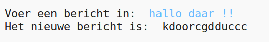
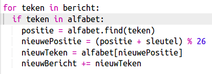
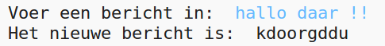
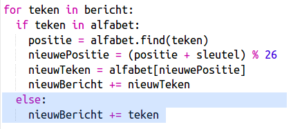
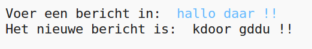

## Extra tekens

Sommige tekens staan ​​niet in het alfabet, wat een fout veroorzaakt.

+ Test de code met enkele tekens die niet in het alfabet voorkomen.
    
    Je kunt bijvoorbeeld het bericht `hallo daar !!` gebruiken.
    
    
    
    Je ziet dat de spaties en de `!` tekens allemaal zijn gecodeerd als de letter 'c'!

+ Om dit te verhelpen, ga je alleen een teken omzetten als het in het alfabet staat. Dat doe je door een `if` -instructie aan de code toe te voegen en de rest van de code te laten inspringen.
    
    

+ Test de code met hetzelfde bericht. Wat gebeurt er deze keer?
    
    
    
    De code slaat nu elk teken over dat niet in het alfabet voorkomt.

+ Het is wellicht beter als de code niets versleutelt als het niet in het alfabet staat, maar gewoon het originele teken blijft gebruiken.
    
    Voeg `else` toe aan de code, zodat het oorspronkelijke teken aan het gecodeerde bericht wordt toegevoegd.
    
    

+ Test de code. Je zou moeten zien dat elk teken in het alfabet is versleuteld, maar alle andere tekens met rust worden gelaten.
    
    