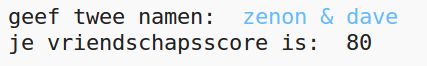
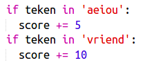
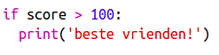

--- challenge ---

## Uitdaging: vriendschapscalculator

Schrijf een programma om te laten zien hoe 2 personen bij elkaar passen, door een vriendschapsscore te berekenen.

Het programma loopt door alle tekens in de 2 namen en geeft punten aan een `score` variabele als bepaalde letters worden gevonden.

Je moet beslissen over de regels voor het toekennen van punten. Je kunt bijvoorbeeld punten toekennen voor klinkers, of voor tekens die in het woord "vriend" voorkomen:

Je kunt de gebruiker ook een persoonlijk bericht sturen op basis van zijn score:

--- /challenge ---

***
Dit project werd vertaald door vrijwilligers:

**Henny van Ham**

**Cor Groot**

Dankzij vrijwilligers kunnen we mensen over de hele wereld de kans geven om in hun eigen taal te leren. Jij kunt ons helpen meer mensen te bereiken door vrijwillig te starten met vertalen - meer informatie op [rpf.io/translate](https://rpf.io/translate).
