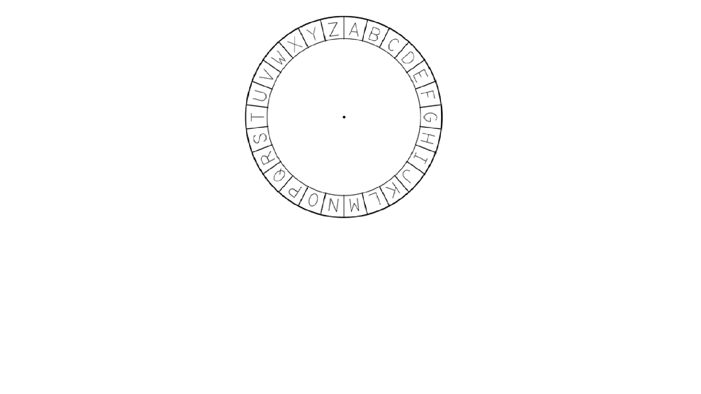
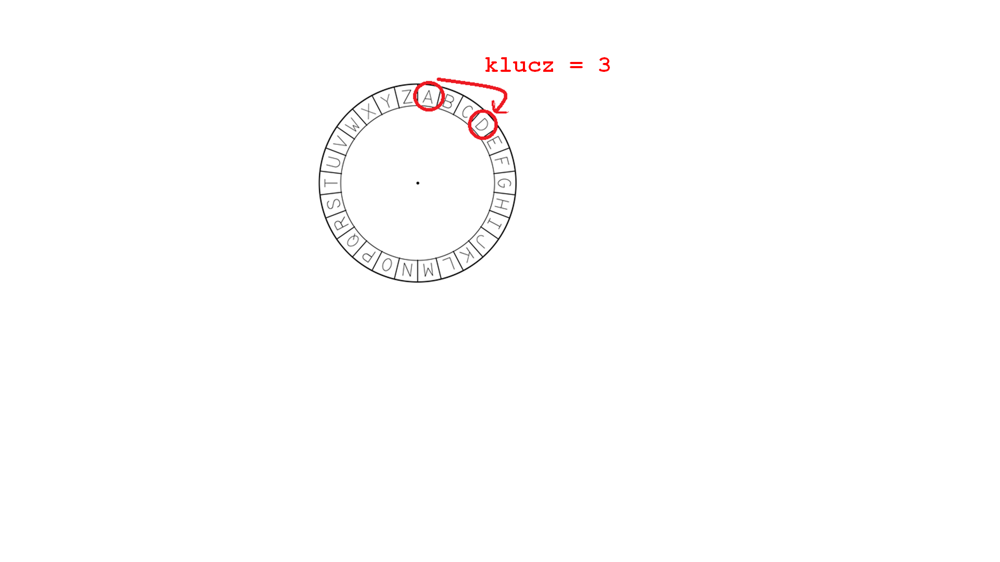

## Szyfr Cezara

Szyfr to rodzaj tajnego kodu, w którym zamieniasz litery tak, aby nikt nie mógł odczytać twojej wiadomości.

Użyjesz jednego z najstarszych i najsłynniejszych szyfrów - **szyfr Cezara** - którego nazwa pochodzi od Juliusza Cezara.

Zanim zaczniemy kodować, użyjmy szyfru Cezara, aby ukryć słowo.

+ Ukrywanie słowa to **szyfrowanie**.
    
    Zacznijmy od zaszyfrowania litery "a". Aby to zrobić, możemy narysować alfabet w kółku, tak jak poniżej:
    
    

+ Aby stworzyć tajną zaszyfrowaną literę z normalnej, musisz mieć tajny klucz. Użyjmy cyfry 3 jako klucza (ale możesz użyć dowolnej liczby).
    
    Aby **zaszyfrować** literę 'a', po prostu przesuń 3 litery zgodnie z ruchem wskazówek zegara, co da ci literę 'd':
    
    

+ Możesz w ten sposób zaszyfrować całe słowo. Na przykład "hello" po zaszyfrowaniu to "khoor". Spróbuj samodzielnie.
    
    + h + 3 = **k**
    + e + 3 = **h**
    + l + 3 = **o**
    + l + 3 = **o**
    + o + 3 = **r**

+ Odzyskiwanie normalnego tekstu to **odszyfrowywanie**. Aby odszyfrować słowo, wystarczy odjąć klucz zamiast go dodawać:
    
    + k - 3 = **h**
    + h - 3 = **e**
    + o - 3 = **l**
    + o - 3 = **l**
    + r - 3 = **o**