## Szyfrowanie liter

Napiszmy program Python, aby zaszyfrować pojedynczy znak.

+ Otwórz pusty szablon dla języka Python w edytorze Trinket: <a href="http://jumpto.cc/python-new" target="_blank">jumpto.cc/python-new</a>.

+ Zamiast rysować alfabet w kółku, wypiszmy go jako zmienną o nazwie `alfabet`.
    
    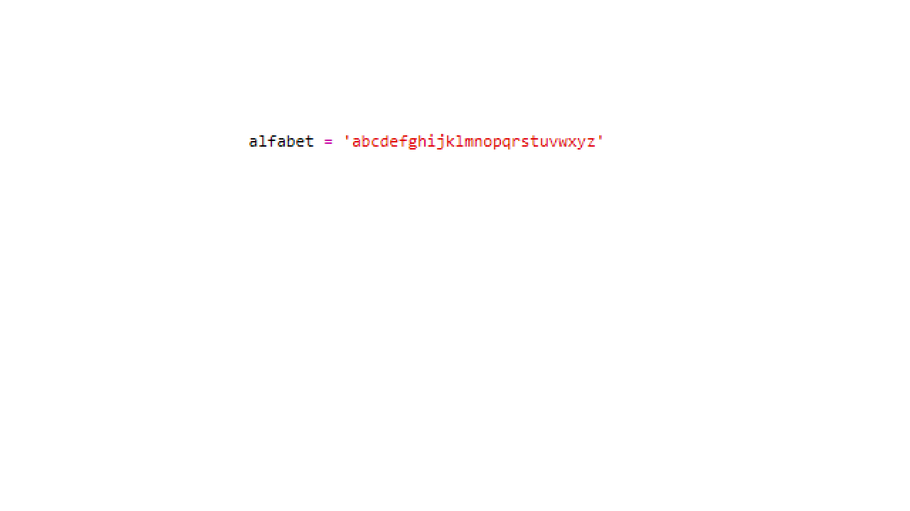

+ Każda litera alfabetu ma pozycję w ciągu, zaczynając od pozycji 0. Tak więc litera 'a' znajduje się na pozycji 0 alfabetu, zaś 'c' na pozycji 2.
    
    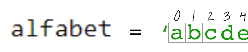

+ Możesz otrzymać literę ze zmiennej `alfabet` wpisując pozycję w nawiasach kwadratowych.
    
    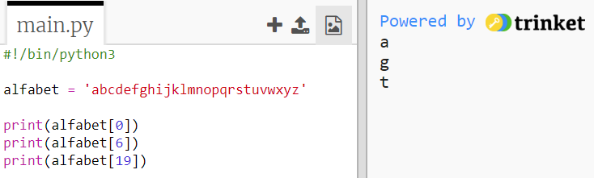
    
    You can delete the `print` statements once you've tried this out.

+ Następnie musisz zrobić tak, aby tajny `klucz` został przechowany w zmiennej.
    
    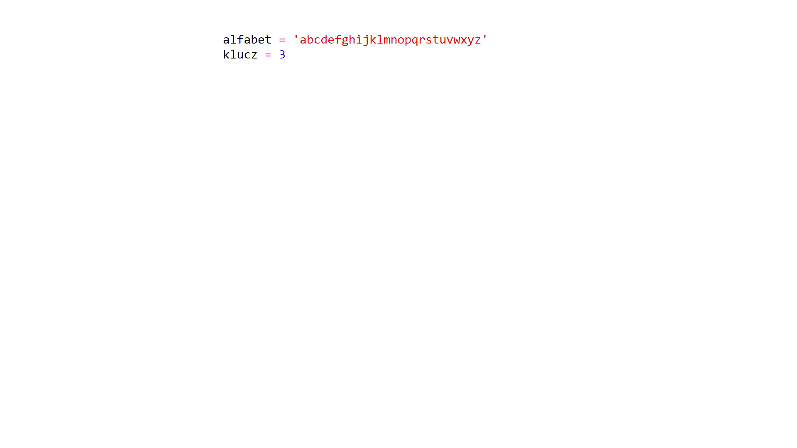

+ Teraz poproś użytkownika o wprowadzenie pojedynczej litery (nazywanej `litera`), która zostanie zaszyfrowana.
    
    

+ Znajdź `pozycję` wprowadzonej `litery`.
    
    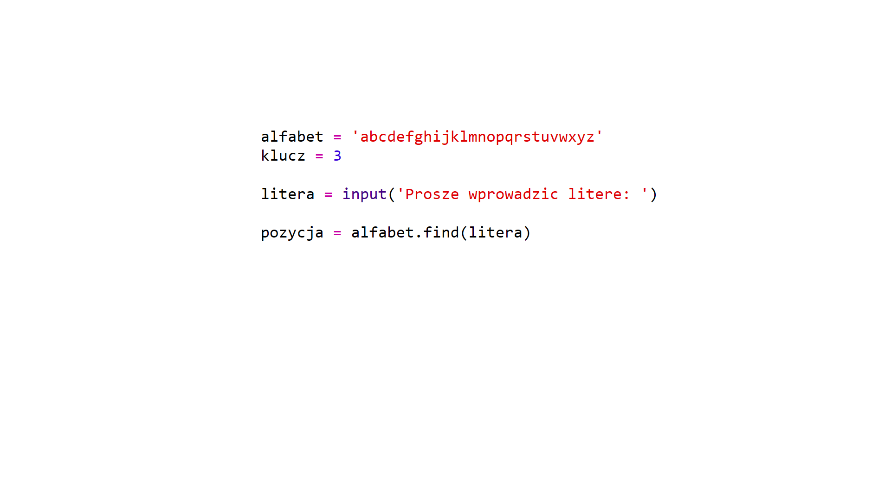

+ Możesz przetestować zapisaną `pozycję` przez wydrukowanie jej. Na przykład litera 'e' znajduje się na pozycji 4 w alfabecie.
    
    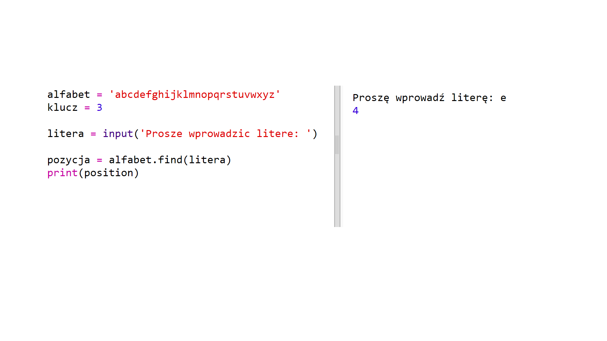

+ Aby zaszyfrować `literę`, musisz dodać `klucz` do jej `pozycji`. Następnie trzeba przechować ją w zmiennej o nazwie `nowaPozycja`.
    
    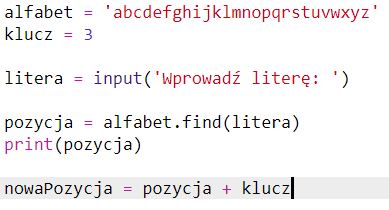

+ Dodaj kod, aby wydrukować nową pozycję litery.
    
    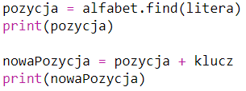

+ Przetestuj swój nowy kod. Jeśli twój `klucz` to 3, program powinien dodać 3 do `pozycji` i zachować to w twojej zmiennej `nowaPozycja`.
    
    Na przykład litera 'e' znajduje się na pozycji 4. Aby ją zaszyfrować, dodaje się `klucz` (3), co daje 7.
    
    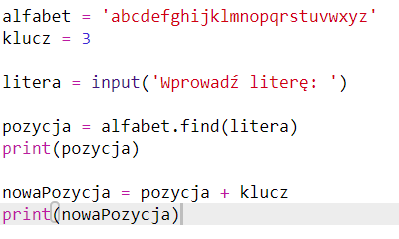

+ Co się stanie, gdy spróbujesz zaszyfrować literę 'y'?
    
    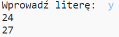
    
    Zauważ, że `nowaPozycja` wynosi wtedy 27, a nie ma przecież 27 liter w alfabecie!

+ Można w tym przypadku użyć znaku `%`, który sprawie, że nowa pozycja zostanie przywrócona do pozycji 0, gdy pozycja 26 zostanie osiągnięta.
    
    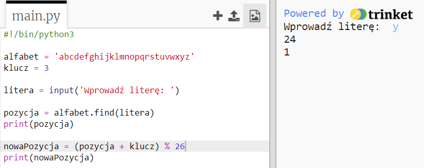

+ Teraz wudrukuje nową pozycję wprowadzonej litery.
    
    Na przykład, dodanie klucza do litery 'e' daje 7, a literą na pozycji 7 w alfabecie jest 'h'.
    
    

+ Wypróbuj swój kod. Możesz także usunąć niektóre z poleceń drukowania i wydrukować jedynie nową literę na końcu.
    
    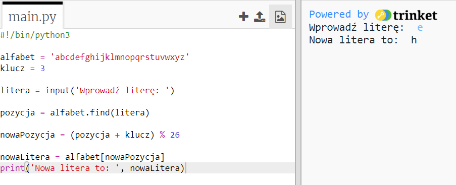