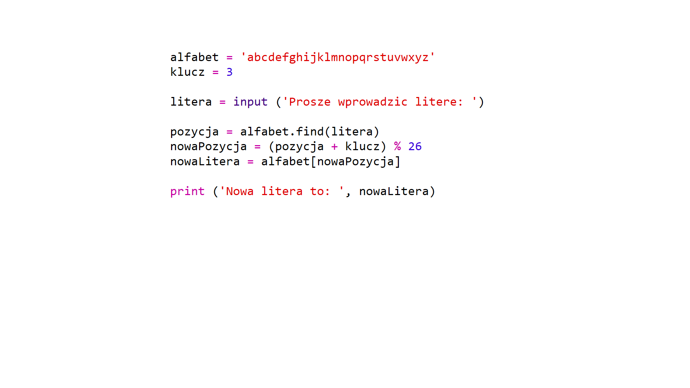
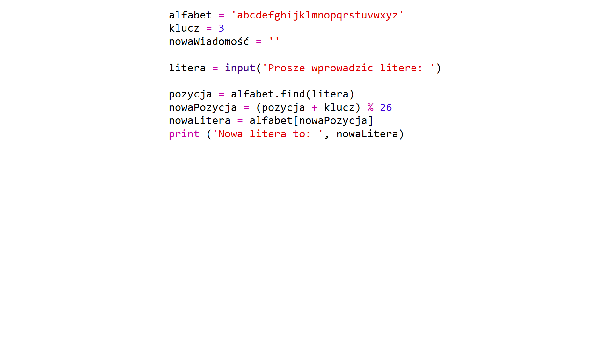
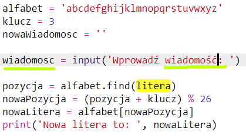
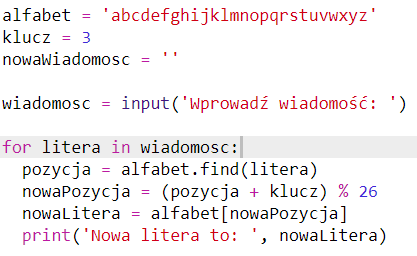
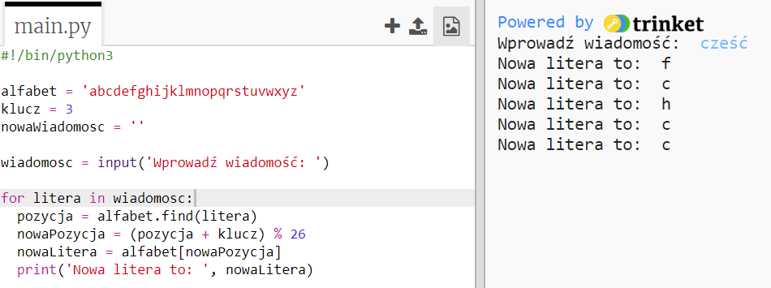
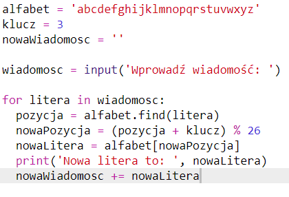
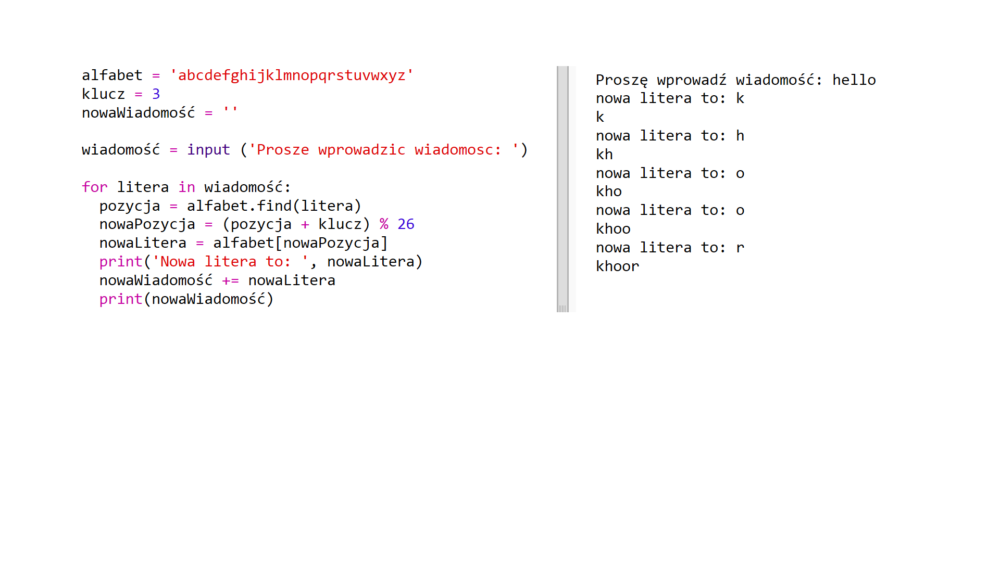
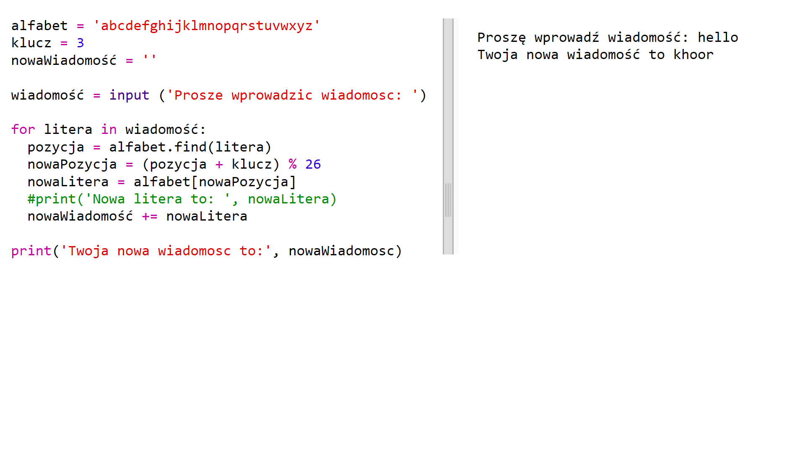

## Szyfrowanie całych wiadomości

Zamiast szyfrować i odszyfrowywać wiadomości po jednej literze, zmieńmy program tak, aby szyfrować całe wiadomości!

+ Po pierwsze sprawdź, czy twój kod wygląda następująco:
    
    

+ Utwórz zmienną do przechowywania nowej zaszyfrowanej wiadomości.
    
    

+ Zmień kod, aby przechować całą wiadomość użytkownika, a nie tylko jedną literę.
    
    

+ Dodaj pętlę `for` do twojego kodu i dodaj wcięcie do reszty kodu, aby powtarzał się dla każdej litery w wiadomości.
    
    

+ Przetestuj swój kod. Każda litera w wiadomości powinna być zaszyfrowana i wydrukowana pojedynczo.
    
    

+ Dodajmy każdą zaszyfrowaną literę do twojej zmiennej `nowaWiadomosc`.
    
    

+ Możesz użyć polecenia `print`, aby wydrukować zawartość zmiennej `nowaWiadomosc` jak zostanie już zaszyfrowana.
    
    

+ Jeśli usuniesz usuniesz wcięcie przed poleceniem `print`, zaszyfrowana wiadomość zostanie wyświetlona tylko raz, na końcu. Możesz również usunąć kod drukowania pozycji liter.
    
    