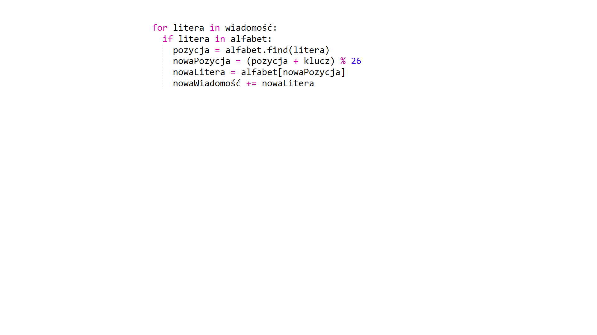
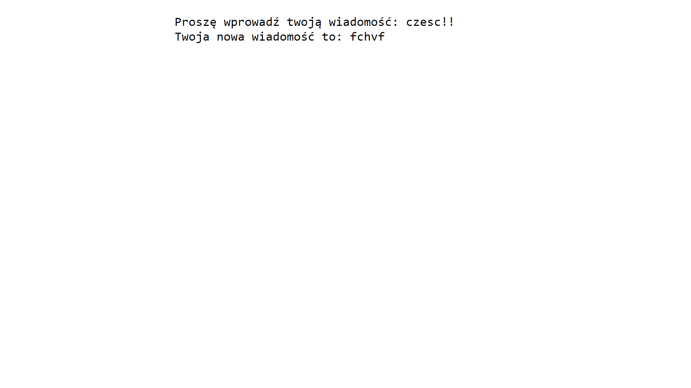
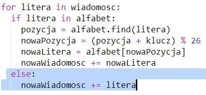
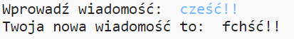

## Dodatkowe litery

Niektórych liter nie ma w alfabecie, co powoduje błąd.

+ Przetestuj swój kod za pomocą niektórych liter, których nie ma w alfabecie.
    
    Na przykład, możesz użyć wiadomości `czesc!!`.
    
    
    
    Zauważ, że spacja i `!` są zaszyfrowane jako litera 'c'!

+ Aby to naprawić, tłumaczysz tylko te litery, które są w alfabecie. Aby to zrobić, dodaj restrykcję `if` do swojego kodu i dodaj wcięcie do reszty kodu.
    
    

+ Przetestuj swój kod z tą samą wiadomością. Co się dzieje tym razem?
    
    
    
    Teraz twój kod po prostu pomija każdą literę, jeśli nie ma jej w alfabecie.

+ Byłoby lepiej, gdyby twój kod nie szyfrował niczego, co nie znajduje się w alfabecie, ale używał tylko oryginalnych liter.
    
    Dodaj komendę `else` do twojego kodu, która po prostu dodaje oryginalne litery do zaszyfrowanej wiadomości.
    
    

+ Przetestuj swój kod. Powinieneś zobaczyć, że każda litera z alfabetu jest zaszyfrowana, ale wszystkie inne znaki pozostają takie same!
    
    