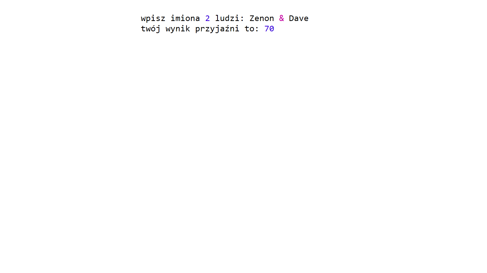
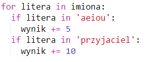
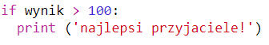

--- challenge ---

## Wyzwanie: kalkulator przyjaźni

Napisz program, który obliczy poziom kompatybilności 2 ludzi.

Program może zapętlać każdą z liter w 2 imionach i dodawać punkty do zmiennej `wynik` za każdym razem, gdy zostaną znalezione określone litery.

Zdecyduje, jakie będą zasady przyznawania punktów. Na przykład możesz przyznać punkty za samogłoski lub litery znalezione w słowie "przyjaciel":

Możesz także przekazać użytkownikowi spersonalizowaną wiadomość na podstawie jej wyniku:

--- /challenge ---

***
### Tłumaczenie wykonane przez wolontariuszy

 Projekt ten przetłumaczył/a **Dominika Kościukiewicz**. 
 
 Dzięki naszym wspaniałym wolontariuszom, ludzie na całym świecie mogą nauczyć się kodowania. Tłumacząc nasze projekty możesz pomóc nam dotrzeć do większej liczby ludzi. Więcej informacji na stronie [rpf.io/translators](https://rpf.io/translators).
