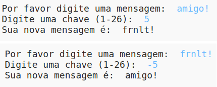

## Introdução:

Neste projeto, você aprenderá como criar seu próprio programa de criptografia, para trocar mensagens secretas com um amigo. Este projeto se relaciona com a atividade "Earth to Principa" na página 16 do Diário Espacial.

<div class="trinket">
  <iframe src="https://trinket.io/embed/python/ddd818a2ac?outputOnly=true&start=result" width="600" height="500" frameborder="0" marginwidth="0" marginheight="0" allowfullscreen>
  </iframe>
  
</div>

### Informação adicional para líderes de clube

Se você precisar imprimir este projeto, use a [versão para impressão](https://projects.raspberrypi.org/en/projects/secret-messages/print).

## \--- collapse \---

## title: Notas do líder do clube

## Introdução:

Neste projeto, as crianças aprenderão como fazer um programa de criptografia, trocar mensagens secretas com um amigo. Este projeto introduz iteração (repetição) sobre uma cadeia de texto.

## Recursos Online

**Este projeto usa o Python 3.** Recomendamos usar o [trinket](https://trinket.io/) para escrever Python online. Este projeto contém os seguintes Trinkets:

* [Novo Trinket Python (em branco) - jumpto.cc/python-new](http://jumpto.cc/python-new)

Há também um trinket contendo o projeto finalizado:

* ['Mensagens Secretas' Finalizado - trinket.io/python/ddd818a2ac](https://trinket.io/python/ddd818a2ac)

* ['Calculadora de Amizade' Finalizado - trinket.io/python/12ffdb16ed](https://trinket.io/python/12ffdb16ed)

## Recursos Offline

Este projeto pode ser [concluído off-line](https://www.codeclubprojects.org/en-GB/resources/python-working-offline/) , se preferir.

Você pode encontrar o projeto concluído na seção "Recursos para Voluntários", que contém:

* messages-finished/messages.py
* messages-finished/friends.py

(Todos os recursos acima também podem ser baixados como arquivos `.zip` do projeto e dos voluntários.)

## Objetivos de aprendizado

* Iteração (repetição) sobre uma variável de string;
* O método `find()`;
* O operador de módulo (`%`).

Este projeto abrange elementos das seguintes vertentes do [Raspberry Pi Digital Making Curriculum](http://rpf.io/curriculum):

* [Combine construções de programação para resolver um problema.](https://www.raspberrypi.org/curriculum/programming/builder)

## Desafios

* Use uma cifra de César - criptografe e descriptografe letras e palavras manualmente;
* Chaves variáveis ​​- permitindo ao usuário inserir uma chave escolhida;
* Criptografar e descriptografar mensagens - criptografando e descriptografando mensagens inteiras;
* Calculadora de amizade - aplicando iteração em texto a um novo problema.

## Perguntas Frequentes

* Ao pesquisar usando `find()` ou `if caractere in alfabeto:`, observe que as buscas fazem distinção entre maiúsculas e minúsculas. As crianças podem usar:
    
    ```python
    mensagem = input("Por favor insira uma mensagem para criptografar: ").lower()
    ```
    
    para tornar a entrada minúscula antes de buscar.

\--- /collapse \---

## \--- collapse \---

## title: Materiais do Projeto

## Recursos do projeto

* [arquivo .zip contendo todos os recursos do projeto](resources/secret-messages-project-resources.zip)
* [Trinket de Python em branco on-line](http://jumpto.cc/python-new)
* [Arquivo Python offline em branco](resources/new-new.py)

## Recursos do líder do clube

* [arquivo .zip contendo todos os recursos do projeto concluídos](resources/secret-messages-volunteer-resources.zip)
* [Projeto Trinket online e completo](https://trinket.io/python/ddd818a2ac)
* [secret-messages-finished/messages.py](resources/secret-messages-finished-messages.py)
* [Desafio da "Calculadora de amizade" concluído on-line](https://trinket.io/python/12ffdb16ed)
* [Desafio da "Calculadora de amizade" concluído offline](resources/friendship-calculator-finished-friends.py)

\--- /collapse \---