## Criptografando cartas

Vamos escrever um programa em Python para criptografar um único caractere.

+ Abra o modelo Trinket em branco do Python: <a href="http://jumpto.cc/python-new" target="_blank">jumpto.cc/python-new</a>.

+ Em vez de desenhar o alfabeto em um círculo, vamos escrevê-lo como uma variável `alfabeto`.
    
    

+ Cada letra do alfabeto tem uma posição, começando na posição 0. Portanto, a letra 'a' está na posição 0 do alfabeto e 'c' está na posição 2.
    
    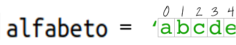

+ Você pode obter uma letra da sua variável `alfabeto` escrevendo a posição entre colchetes.
    
    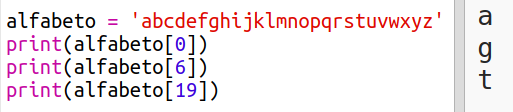
    
    Você pode excluir as declarações de `print` depois de tentar isso.

+ Em seguida, você precisará armazenar a `chave` secreta em uma variável.
    
    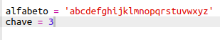

+ Em seguida, peça ao usuário uma única letra (chamada de `caractere`) para criptografar.
    
    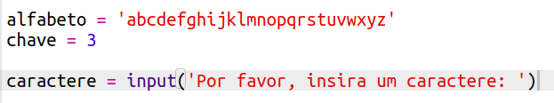

+ Encontre a `posição` do `caractere`.
    
    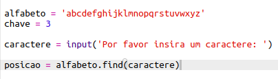

+ Você pode testar a `posição` armazenada imprimindo-a. Por exemplo, o caractere 'e' está na posição 4 do alfabeto.
    
    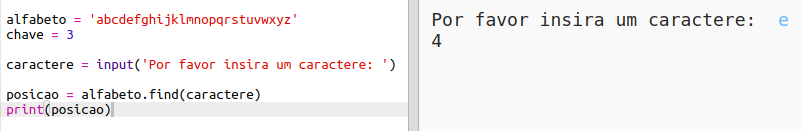

+ Para criptografar o `caractere`, você deve adicionar a `chave` à `posição`. Isso é então armazenado na variável `novaPosicao`.
    
    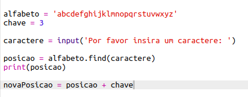

+ Adicione código para imprimir a nova posição do caractere.
    
    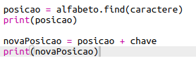

+ Test out your new code. As your `key` is 3, it should add 3 to the `position` and store it in your `newPosition` variable.
    
    For example, letter 'e' is at position 4. To encrypt, you add the `key` (3), giving 7.
    
    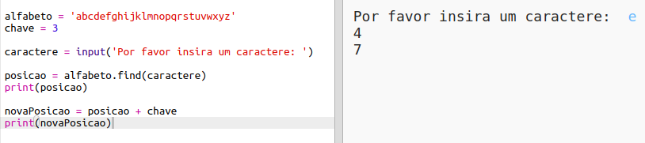

+ What happens when you try and encrypt the letter 'y'?
    
    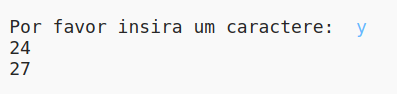
    
    Notice how the `newPosition` is 27, and there aren't 27 letters in the alphabet!

+ You can use a `%` to tell the new position to go back to position 0 once it gets to position 26.
    
    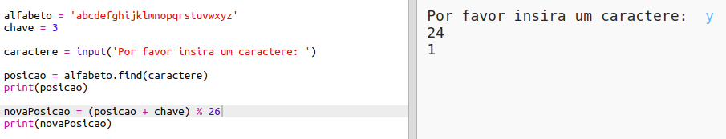

+ Finally, you want to print the letter at the new position.
    
    For example, adding the key to the letter 'e' gives 7, and the letter at position 7 of the alphabet is 'h'.
    
    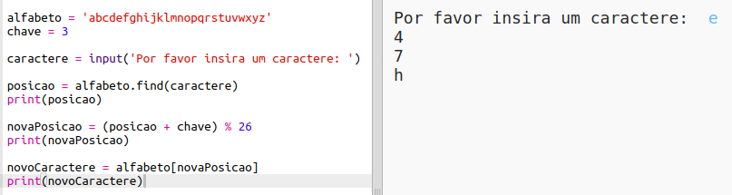

+ Try out your code. You can also remove some of your print statements, just printing the new character at the end.
    
    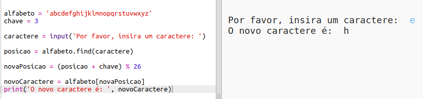