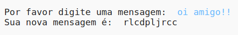
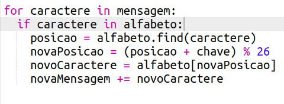
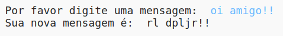

## Caracteres extras

Alguns caracteres não estão no alfabeto, o que causa um erro.

+ Teste seu código com alguns caracteres que não estão no alfabeto.
    
    Por exemplo, você poderia usar a mensagem `oi amigo!!`.
    
    
    
    Observe que os caracteres de espaço e `!` são todos criptografados como a letra 'c'!

+ Para corrigir isso, você só quer traduzir um caractere se estiver no alfabeto. Para fazer isso, adicione uma instrução `if` ao seu código e indente o resto do seu código.
    
    

+ Teste seu código com a mesma mensagem. O que acontece desta vez?
    
    
    
    Agora, seu código simplesmente ignora qualquer caractere se não estiver no alfabeto.

+ Seria melhor se o seu código não criptografasse qualquer coisa que não estivesse no alfabeto, mas apenas usasse o caractere original.
    
    Adicione uma instrução `else` ao seu código, que apenas adiciona o caractere original à mensagem criptografada.
    
    

+ Teste seu código. Você deve ver que qualquer caractere no alfabeto é criptografado, mas quaisquer outros caracteres são deixados em paz!
    
    