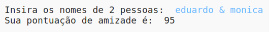
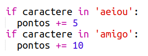
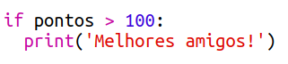

\--- challenge \---

## Desafio: calculadora de amizade

Write a program to show how compatible 2 people are, by calculating a friendship score.

The program could loop through each of the characters in the 2 names, and add points to a `score` variable each time certain letters are found.

You should decide on rules for awarding points. For example, you could award points for vowels, or characters that are found in the word "friend":

You could also give the user a personalised message, based on their score:

\--- /challenge \---