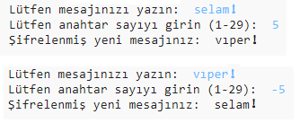

## Giriş:

Bu projede, bir arkadaşınızla gizli mesajlaşmak için kendi şifreleme programınızı nasıl yapacağınızı öğreneceksiniz. Bu proje, Uzay Günlüğü'nün 16. sayfasında yer alan "Earth to Principia" etkinliği ile bağdaştırılıyor.

<div class="trinket">
  <iframe src="https://trinket.io/embed/python/402256078c?outputOnly=true&start=result" width="600" height="500" frameborder="0" marginwidth="0" marginheight="0" allowfullscreen>
  </iframe>
  
</div>

### Kulüp liderleri için ek bilgi

Bu projeyi yazdırmanız gerekiyorsa, lütfen [Yazıcı dostu sürüm](https://projects.raspberrypi.org/en/projects/secret-messages/print)ü kullanın.

## \--- collapse \---

## title: Kulüp lideri notları

## Giriş:

Bu projede çocuklar bir arkadaşıyla gizli mesajlaşmak için şifreleme programının nasıl yapıldığını öğrenecekler. Bu proje, bir metin dizgisinde yinelemeyi (looping) tanıtmaktadır.

## Çevrimiçi Kaynaklar

**Bu proje Python 3'ü kullanıyor.** Çevrimiçi Python programlama için [trinket](https://trinket.io/) kullanmanızı tavsiye ederiz. Bu proje aşağıdaki Trinketları içermektedir:

* [Yeni (boş) Python Trinket'ı - jumpto.cc/python-new](http://jumpto.cc/python-new)

Ayrıca tamamlanmış projeyi içeren bir trinket da bulunmaktadır:

* ['Gizli Mesajlar' Tamamlanmış- trinket.io/python/402256078c](https://trinket.io/python/402256078c)

* ['Arkadaşlık Hesaplayıcısı' Tamamlanmış - trinket.io/python/2e852cd687](https://trinket.io/python/2e852cd687)

## Çevrimdışı Kaynaklar

Bu proje, istenirse [çevrimdışı](https://www.codeclubprojects.org/en-GB/resources/python-working-offline/) olarak tamamlanabilir.

Bu projenin tamamlanmış bir versiyonunu aşağıdakileri içeren 'Gönüllü Kaynaklar' bölümünde de bulabilirsiniz:

* messages-finished/messages.py
* messages-finished/friends.py

(Yukarıdaki kaynakların tümü proje ve gönüllü olarak indirilebilen `.zip` dosyalarıdır)

## Kazanımlar

* Bir değişken dizesi üzerinde yineleme (looping);
* `find()` yöntemi;
* Modül operatörü (`%`).

Bu proje, [Raspberry Pi Digital Making Curriculum](http://rpf.io/curriculum) 'un aşağıdaki bölümlerinden unsurları kapsamaktadır:

* [Bir problemi çözmek için programlama yapılarını birleştirin.](https://www.raspberrypi.org/curriculum/programming/builder)

## Meydan Okumalar

* Sezar şifresi kullanın - harfleri ve kelimeleri elle şifreleyin ve şifresini çözün;
* Değişken anahtarlar - kullanıcının seçilen bir anahtarı girmesine izin verir;
* Mesajları şifrelemek ve şifresini çözmek - tüm mesajları şifrelemek ve şifresini çözmek;
* Arkadaşlık hesaplayıcısı - yeni bir probleme metin döngüsü uygulama.

## Sıkça Sorulan Sorular

* `find()` ya da `if harf in alfabe:` işlevlerini kullanarak arama yaptırdığınızda, aramaların büyük/küçük harfe duyarlı olduğunu unutmayın. Çocuklar şunu:
    
    ```python
    mesaj = input("Lütfen şifrelemek istediğiniz mesajı yazın: ").lower()
    ```
    
    arama yapmadan önce küçük harfe geçmek için kullanabilirler.

\--- /collapse \---

## \--- collapse \---

## title: Proje materyalleri

## Proje kaynakları

* [tüm proje kaynaklarını içeren .zip dosyası](resources/secret-messages-project-resources.zip)
* [Çevrimiçi boş Python Trinket'ı](http://jumpto.cc/python-new)
* [Çevrimdışı boş Python dosyası](resources/new-new.py)

## Kulüp lideri için kaynaklar

* [tamamlanmış tüm proje kaynaklarını içeren .zip dosyası](resources/secret-messages-volunteer-resources.zip)
* [Çevrimiçi tamamlanmış Trinket projesi](https://trinket.io/python/402256078c)
* [secret-messages-finished/messages.py](resources/secret-messages-finished-messages.py)
* [Çevrimiçi tamamlanmış 'Arkadaşlık Hesaplayıcısı' meydan okuması](https://trinket.io/python/2e852cd687)
* [çevrimdışı tamamlanmış 'Arkadaşlık Hesaplayıcısı' meydan okuması](resources/friendship-calculator-finished-friends.py)

\--- /collapse \---