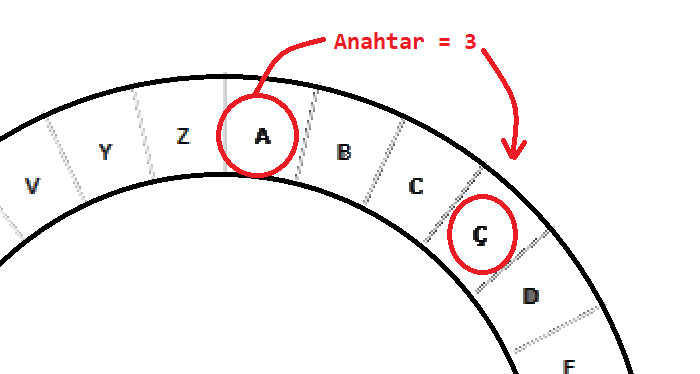

## Sezar şifresi

Bir şifre, kimsenin mesajınızı okuyamaması için harflerin yerini değiştirdiğiniz bir tür gizli koddur.

En eski ve en ünlü şifreleme yöntemlerinden birini kullanacaksınız, ismini Jül Sezar'dan alan **Sezar şifresi**.

Kodlamaya başlamadan önce, bir kelimeyi gizlemek için Sezar şifresini kullanmayı deneyelim.

+ Bir kelimeyi gizlemeye **şifreleme** denir.
    
    'a' harfini şifreleyerek başlayalım. Bunu yapmak için, alfabeyi aşağıdaki gibi bir daireye çizebiliriz:
    
    

+ Normalinden farklı olarak şifrelenmiş gizli bir harf yapmak için gizli bir anahtara ihtiyacınız var. Hadi anahtar olarak 3 sayısını kullanalım (istediğiniz başka bir sayı da olabilir).
    
    'a' harfini **şifrelemek** için saat yönünde 3 harf ilerleyin, bu size 'ç' harfini verecektir:
    
    

+ Bir kelimenin tamamını şifrelemek için öğrendiklerinizi kullanabilirsiniz. Örneğin, 'selam' kelimesinin şifreli hali 'uğoçö' dir. Kendinizde deneyin.
    
    + s + 3 = **u**
    + e + 3 = **ğ**
    + l + 3 = **o**
    + a + 3 = **ç**
    + m + 3 = **ö**

+ Metnin normale döndürülmesine ise **şifre çözme** denir. Bir kelimenin şifresini çözmek için, bu kez eklemek yerine anahtar sayıyı çıkarın:
    
    + u - 3 = **s**
    + ğ - 3 = **e**
    + o - 3 = **l**
    + ç - 3 = **a**
    + ö - 3 = **m**