## Şifreli harfler

Hadi bir tek harfi şifrelemek için bir Python programı yazalım.

+ Trinket'ta boş Python şablonunu açın: <a href="http://jumpto.cc/python-new" target="_blank">jumpto.cc/python-new</a>.

+ Alfabeyi bir daire içine çizmek yerine, onu `alfabe` değişkeni olarak yazalım.
    
    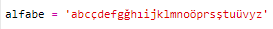

+ Alfabedeki her harf, 0 konumundan başlayan bir konuma sahiptir. Bu nedenle 'a' harfi alfabenin 0 konumunda ve 'c' harfi 2. konumdadır.
    
    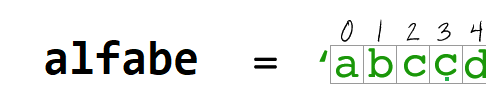

+ `alfabe` değişkeninizden bir harfe, konumunu köşeli parantezin içine yazarak ulaşabilirsiniz.
    
    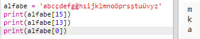
    
    Bunu bir kez denedikten sonra `print` komutlarını silebilirsiniz.

+ Daha sonra gizli `anahtarı` bir değişkene kaydetmeniz gerekecek.
    
    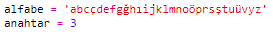

+ Ardından kullanıcıdan şifrelemek bir harf girmesini isteyin (`harf` değişkeni isimli).
    
    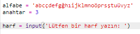

+ `harf` 'in `konum` 'unu bulun.
    
    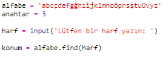

+ Veri kaydedilmiş `konum` değişkenini ekrana yazdırarak test edebilirsiniz. Örneğin, 'e' harfi alfabede 5. konumdadır.
    
    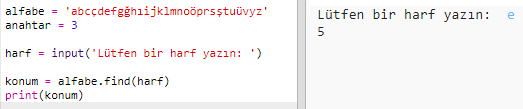

+ `harf`i şifrelemek için, `konum` değişkeniyle `anahtar` değişkenini toplamalısınız. Daha sonra elde edilen değer `yenikonum` değişkenine kaydedilir.
    
    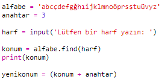

+ Harfin yeni konumunu yazdırmak için kod ekleyin.
    
    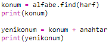

+ Yeni kodunuzu test edin. `anahtar`'ınız 3 olduğundan `konum` değişkenine 3 eklemeli ve bunu `yenikonum` değişkeninde saklanmalı.
    
    Örneğin, 'e' harfi 5 konumunda. Şifrelemek için `anahtar`'la (3) toplarız, 8 sonucunu verir.
    
    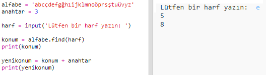

+ 'Y' harfini şifreleyip denediğinizde neler olur?
    
    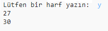
    
    Alfabede 30 harf olmadığı halde `yenikonum` değişkeninin nasıl 30 olduğuna dikkat edin!

+ Yeni konum 28 olduğunda tekrar baştaki 0 konumuna dönmesini sağlamak için `%` işaretini kullanabilirsiniz.
    
    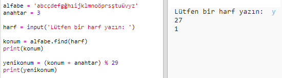

+ Son olarak, yeni konumdaki harfi yazdırmak istiyorsunuz.
    
    Örneğin 'e' harfine anahtarı eklediğimizde sonuç 8 oluyordu, alfabedeki 8. konumda ise 'ğ' harfi var.
    
    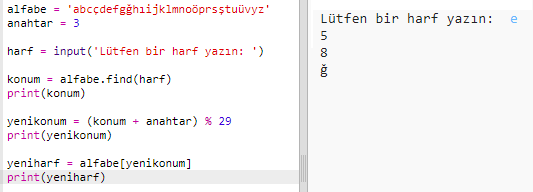

+ Kodunuzu deneyin. Yeni harfi sadece sona yazdıran bazı yazdır komutu satırlarınızı, koddan kaldırabilirsiniz.
    
    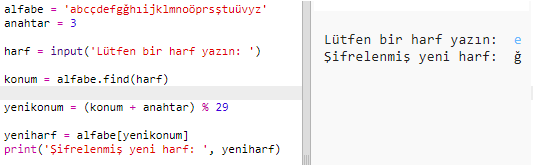