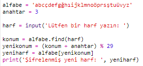
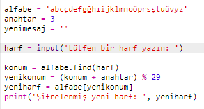
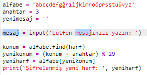
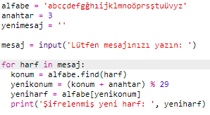
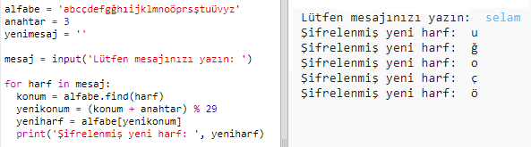
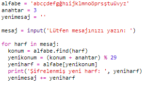
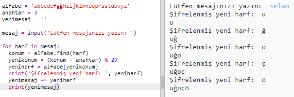
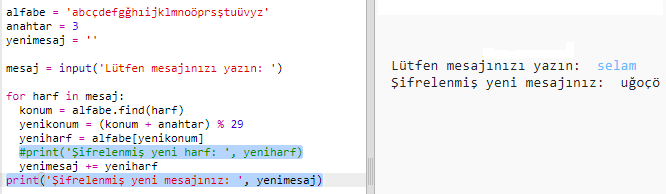

## Mesajın tamamını şifreleme

Mesajları bir seferde sadece birer harf şifrelemek ve şifresini çözmek yerine, mesajın tamamını şifrelemek için programı değiştirelim!

+ Öncelikle, kodunuzun şöyle görünüp görünmediğini kontrol edin:
    
    

+ Yeni şifreli mesajı saklamak için bir değişken oluşturun.
    
    

+ Bir harf yerine, kullanıcının mesajının hepsini bir değişkene kaydedecek şekilde kodunuzu değiştirin.
    
    

+ `for` döngüsünü ekleyip kodun kalan kısmına girinti yaparak mesajın her harfinde kodun tekrarlanmasını sağlayın.
    
    

+ Kodunuzu test edin. Mesajdaki her harfin aynı anda şifrelenmiş ve tek seferde ekrana yazılmış olduğunu görmelisiniz.
    
    

+ Hadi şimdi şifrelenmiş her harfi `yenimesaj` değişkeninize ekleyelim.
    
    

+ `yenimesaj` 'ınızın şifrelenmiş halini `print` komutuyla yazdırabilirsiniz.
    
    

+ `print` komutunun önündeki boşlukları silerseniz, şifreli mesaj en sonda sadece bir kez görüntülenecektir. Ayrıca harf konumlarını yazdıran kodu da silebilirsiniz.
    
    