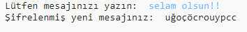
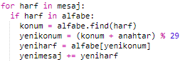
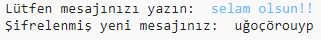
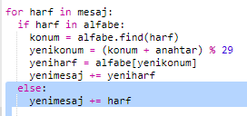
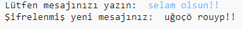

## Fazladan karakterler

Bazı harfler alfabede olmadıkları için hataya sebep olabilirler.

+ Kodunuzu alfabenizde olmayan bazı harflerle test edin.
    
    Örneğin, `Selam olsun!` mesajını kullanabilirsiniz.
    
    
    
    Mesajın kelimeleri arasındaki boşluk ve `!` ünlem işareti 'c' harfi şeklinde şifreleniyor!

+ Düzeltmek için sadece alfabede olan harflerin şifrelenmesini isteyebilirsiniz. Bunu yapmak için `if` fonksiyonunu kodunuza ekleyip, kodun kalan kısmına girinti yapmalısınız.
    
    

+ Kodunuzu aynı mesajla tekrar test edin. Bu sefer ne olacak?
    
    
    
    Şimdi kodunuz, alfabede olmayan karakterleri atlayacak.

+ Kodunuz alfabede olmayan hiçbir karakteri şifrelemeyip sadece olanları şifrelediğinde daha iyi olacaktır.
    
    Kodunuza `else` işlevini ekleyerek şifreli mesaja sadece orijinal harflerin girmesini sağlayabilirsiniz.
    
    

+ Kodunuzu deneyin. Alfabedeki her harfin şifrelenip, diğer karakterlerin bırakıldığını görmüş olmalısınız!
    
    