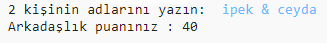
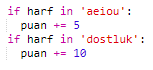
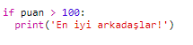

\--- challenge \---

## Meydan okuma: Arkadaşlık hesaplayıcısı

Arkadaşlık puanını hesaplayarak, 2 kişinin birbiriyle ne kadar uyumlu olduğunu gösteren bir program yaz.

Program her iki isimdeki harfler arasında geçiş yapabilir ve belirlenmiş harfleri bulduğunda bunu `puan` değişkenine sayı olarak ekler.

Puan kazanma yöntemine karar vermelisin. Örneğin, sesli harfler veya "dostluk" kelimesinde bulunan harfler için puan verebilirsiniz:

Ayrıca, kullanıcıya puanlarına göre kişisel bir mesaj da verebilirsiniz:

\--- /challenge \---