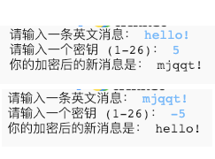

## 介绍：

在这个项目中，您将学习如何制作自己的加密程序，用来与朋友发送和接收秘密消息。 该项目与《太空日记》中第16页的＂从地球到普林西亚＂活动有关。

<div class="trinket">
  <iframe src="https://trinket.io/embed/python/402256078c?outputOnly=true&start=result" width="600" height="500" frameborder="0" marginwidth="0" marginheight="0" allowfullscreen>
  </iframe>
  
</div>

### 俱乐部导师的附加信息

如果您需要打印此项目，请使用[适合打印版本](https://projects.raspberrypi.org/en/projects/secret-messages/print) 。

## \--- collapse \---

## title: 俱乐部导师说明

## 介绍：

在这个项目中，孩子们将学习如何制作加密程序，用来与朋友发送和接收秘密消息。该项目介绍用于文本字符串上的迭代（循环）。

## 在线资源

**本项目使用Python 3。**我们建议使用[ trinket](https://trinket.io/)在线编写Python代码。本项目包含以下Trinkets：

* [新建（空白）Python Trinket -- jumpto.cc/python-new](http://jumpto.cc/python-new)

还有一个包括已完成项目的Trinket：

* [完成的‘秘密消息’ -- trinket.io/python/402256078c](https://trinket.io/python/402256078c)

* [完成的‘友谊计算器’ -- trinket.io/python/2e852cd687](https://trinket.io/python/2e852cd687)

## 离线资源

如果你愿意，本项目可以[离线完成](https://www.codeclubprojects.org/en-GB/resources/python-working-offline/)。

你也可以在 “志愿者资源'”部分找到该项目的完成版本，里面包含：

* messages-finished/messages.py
* messages-finished/friends.py

(上述所有资源都可以以`.zip`压缩包的形式下载。)

## 学习目标

* 对字符串变量进行迭代（循环）;
* 使用`find()`方法；
* 模数计算符（`％` ）。

本项目涵盖[树莓派数字制作课程](http://rpf.io/curriculum)如下几方面内容：

* [综合利用编程结构解决问题。](https://www.raspberrypi.org/curriculum/programming/builder)

## 挑战

* 使用凯撒密码 - 手动加密和解密字母和单词；
* 可变密钥 - 允许用户输入选好的密钥;
* 加密和解密消息 - 加密和解密整个消息；
* 友谊计算器 - 在新问题中使用文本迭代。

## 常见问题

* 当使用`查找()`或`if char in alphabet:`进行搜索时，请注意搜索的文本是区分大小写的。孩子们可以使用：
    
    ```python
    message = input("Please enter a message to encrypt: ").lower()
    ```
    
    来进行搜索前调成小写输入。

\--- /collapse \---

## \--- collapse \---

## title: 项目材料

## 项目资源

* [包含所有项目资源的.zip文件](resources/secret-messages-project-resources.zip)
* [在线空白Python Trinket项目](http://jumpto.cc/python-new)
* [离线空白Python文件](resources/new-new.py)

## 俱乐部导师资源

* [包含所有完成项目资源的.zip文件](resources/secret-messages-volunteer-resources.zip)
* [在线已完成的Trinket项目](https://trinket.io/python/402256078c)
* [secret-messages-finished/messages.py](resources/secret-messages-finished-messages.py)
* [在线已完成的‘友谊计算器’挑战](https://trinket.io/python/2e852cd687)
* [离线已完成‘友谊计算器’挑战](resources/friendship-calculator-finished-friends.py)

\--- /collapse \---