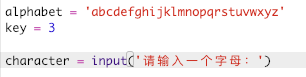
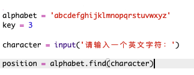
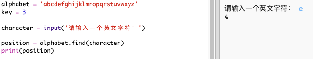
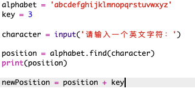
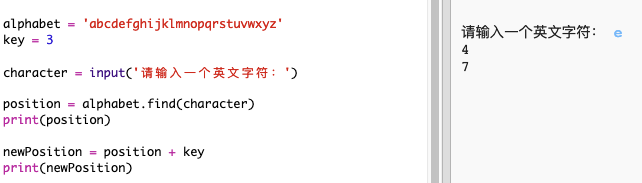
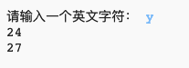
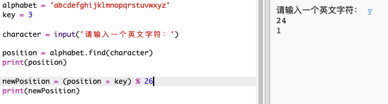
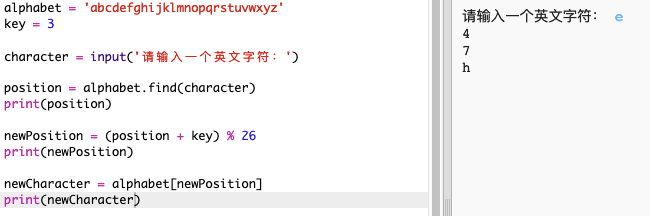
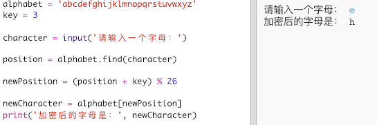

## 对字母进行加密

让我们编写一个Python程序来加密单个字符。

+ 单击链接<a href="http://jumpto.cc/python-new" target="_blank">jumpto.cc/python-new</a>，打开一个空白的Trinket Python模版。

+ 与其在圆圈中绘制字母表, 不如将其写入`alphabet`变量中。
    
    

+ 字母表中的每个字母都有一个位置，从位置0开始。因此字母“a”位于字母表的第0位，“c”位于第2位。
    
    

+ 通过将其位置写在方括号内, 可以从 `alphabet` 变量中获取某个字母。
    
    
    
    尝试此操作后, 您可以删除 `print` 语句。

+ 接下来，你要将密钥保存在变量`key`中。
    
    

+ 接下来，询问用户一个字母（保存到变量`character`）进行加密。
    
    

+ 找到字母（变量` character`）在字母表中的位置（变量` position`）。
    
    

+ 你可以通过显示变量` position`来进行测试。比如，字母”e"在字母表中的位置是4。
    
    

+ 若要加密字母（在变量` character`中），你需要将字母的位置（在变量` position`中）加上密钥的值（在变量` key`中），然后将其保存到` newPosition `变量中。
    
    

+ Add code to print the new character position.
    
    

+ Test out your new code. As your `key` is 3, it should add 3 to the `position` and store it in your `newPosition` variable.
    
    For example, letter 'e' is at position 4. To encrypt, you add the `key` (3), giving 7.
    
    

+ What happens when you try and encrypt the letter 'y'?
    
    
    
    Notice how the `newPosition` is 27, and there aren't 27 letters in the alphabet!

+ You can use a `%` to tell the new position to go back to position 0 once it gets to position 26.
    
    

+ Finally, you want to print the letter at the new position.
    
    For example, adding the key to the letter 'e' gives 7, and the letter at position 7 of the alphabet is 'h'.
    
    

+ Try out your code. You can also remove some of your print statements, just printing the new character at the end.
    
    