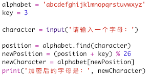
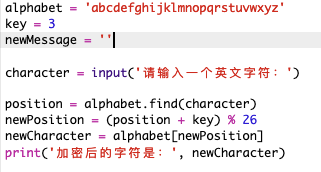
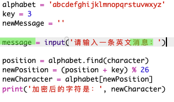
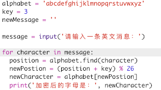
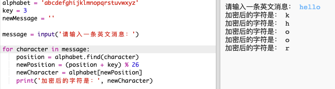
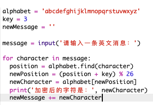
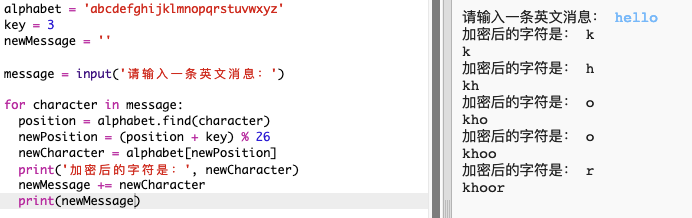
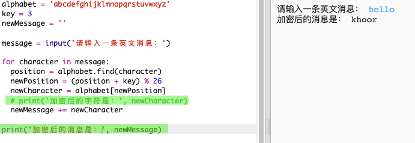

## 对完整信息进行加密

让我们修改程序来加密完整的信息，而非一次仅加密和解密一个字符的信息！

+ 首先，请检查你的代码是否如下所示：

	

+ 创建一个变量来储存新加密的信息。

	

+ 更改你的代码来储存用户的信息，而不仅仅是一个字符。

	

+ 向你的代码添加 `for` 循环，并缩进剩余的代码，使其对信息中的每个字符重复运行。

	

+ 测试你的代码。你会看到信息中的每个字符都被加密并打印出来，一次一个。

	

+ 让我们向你的 `newMessage` 变量添加每个被加密的字符。

	

+ 由于信息被加密，你可以 `print`（打印）该 `newMessage`。

	

+ 如果你删掉 `print`（打印）语句之前的空格，被加密的信息仅会在末尾显示一次。你还可以删除打印字符位置的代码。

	

