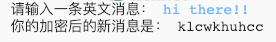
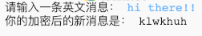

## 其他字符

某些字符不在字母表中，这会导致错误发生。

+ 用一些不在字母表中的字符测试您的代码。
    
    例如，您可以试一下消息 `hi there!!`。
    
    
    
    注意空格符和`!`都被加密成了字母＇c＇！

+ 要解决这个问题，你希望只加密字母表中的字符。为此，可以添加一个`if`语句，并缩进余下的代码。
    
    

+ 使用相同的消息测试您的代码。这次会发生什么？
    
    
    
    现在，对于任何不在字母表中的字符，你的代码将会忽略它们。

+ 如果你的代码没有加密任何不在字母表中的字符，而是直接输出这些字符本身，这样效果就会更好。
    
    添加一个`else`语句，只是将这些字符本身添加到加密后的消息中去。
    
    

+ 测试您的代码。你应该看到所有在字母表中的字符都是加密的，但任何其他字符都保留了下来！
    
    