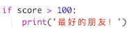

--- challenge ---
## 挑战：友情计算器
编写一个程序，来通过计算友情得分，显示 2 人的关系有多密切。

该程序可循环遍历 2 个名字中的每个字符，并在每次发现特定字母时向 `score`（分数）变量添加分数。

你应决定奖励分数的规则。例如，你可以对元音或者存在于“friend”这个词中的字母奖励分数：

你还可以根据用户的分数，向他们提供一条个性化的信息：

--- /challenge ---