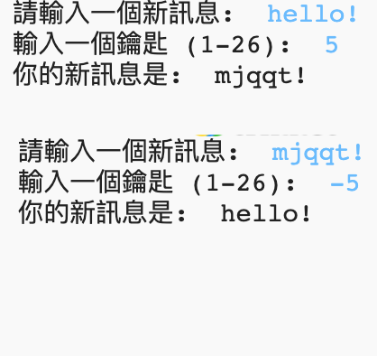

## 介紹

在這個專案中，你將學到如何製作自己的加密程序，以及如何和朋友傳送秘密訊息。 這個專案與《太空日記》第16頁的「地球原理」活動有關。

<div class="trinket">
  <iframe src="https://trinket.io/embed/python/74ddabdccd?outputOnly=true&start=result" width="600" height="500" frameborder="0" marginwidth="0" marginheight="0" allowfullscreen>
  </iframe>
  
</div>

### 給教師的其它資訊

如果你需要列印這個專案，可以先切換成[列印友好模式](https://projects.raspberrypi.org/zh-TW/projects/secret-messages/print)。

--- collapse ---
---
title: 給教師的其它資訊
---

## 介紹：

在這個專案中，孩子們將學習如何製作加密程序，以及如何與朋友傳送秘密訊息。本專案介紹了對文字字串進行迭代（迴圈）

## 線上資源

**這個專案使用 Python 3。**我們建議利用 [trinket](https://trinket.io/) 在線上撰寫 Python 程式。

* [新建（空白）Python Trinket -jumpto.cc/python-new](http://jumpto.cc/python-new)

還有一個包含完成的專案的trinket：

* [「秘密訊息」已完成 -- trinket.io/python/74ddabdccd](https://trinket.io/python/74ddabdccd)

* [「友誼計算器」完成 -- trinket.io/python/378addac10](https://trinket.io/python/378addac10)

## 離線資源

這個專案也可以[離線完成](https://www.codeclubprojects.org/en-GB/resources/python-working-offline/)。

您可以在「志願者資源」部分中找到完成的項目，其中包括：

* messages-finished/messages.py
* messages-finished/friends.py

（以上所有資源也可以作為專案和志願者`.zip下載`文件）。

## 學習目標

* 對字串變數進行迭代（循環）；
* `find()`方法；
* 運算符（`％`）。

本專案涵蓋 [樹莓派數位化課程](http://rpf.io/curriculum)以下內容：

* [結合程式設計結構來解決問題。](https://www.raspberrypi.org/curriculum/programming/builder)

## 挑戰

* 使用凱薩密碼-手動加密和解密字母和單詞；
* 金鑰—允許用戶輸入所選金鑰；
* 加密和解密訊息—加密和解密整個訊息；
* 友誼計算器—將文本迭代應用於解決新問題。

## 常見問題

* 當使用`find()`或`if char in alphabet:`搜索時，請注意，搜索的文字是區分大小寫。兒童們可以使用：
    
    ```python
    message = input("請輸入需要加密的消息：").lower（）
    ```
    
    把需要搜索的字母轉換成小寫。

--- /collapse ---

--- collapse ---
---
title: 專案材料
---

## 專案資源

* [包含所有專案資源的 .zip 文件](resources/secret-messages-project-resources.zip)
* [線上空白的 Python Trinket](http://jumpto.cc/python-new)
* [線上空白的 Python 檔案](resources/new-new.py)

## 教師資源

* [包含所有專案資源的 .zip 文件](resources/secret-messages-volunteer-resources.zip)
* [線上完整的 Python Trinket 專案](https://trinket.io/python/74ddabdccd)
* [secret-messages-finished/messages.py](resources/secret-messages-finished-messages.py)
* [線上完整的「友誼計算器」挑戰](https://trinket.io/python/378addac10)
* [離線完整的「友誼計算器」挑戰](resources/friendship-calculator-finished-friends.py)

--- /collapse ---