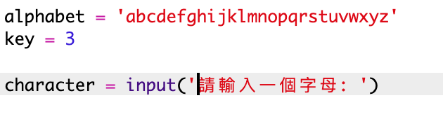
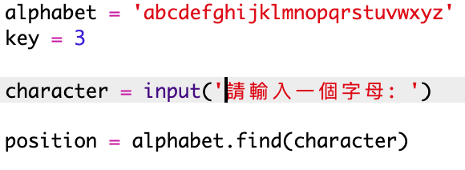
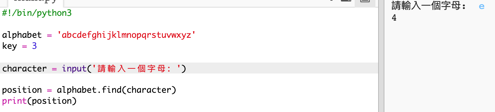
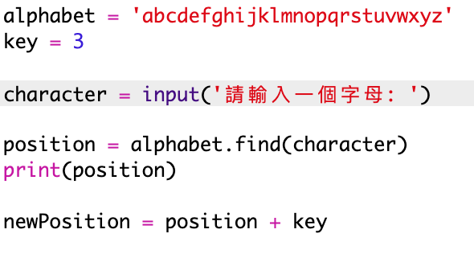
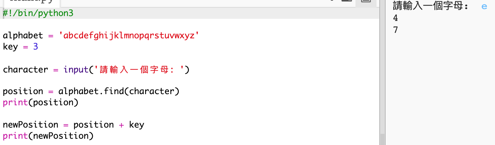
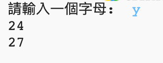
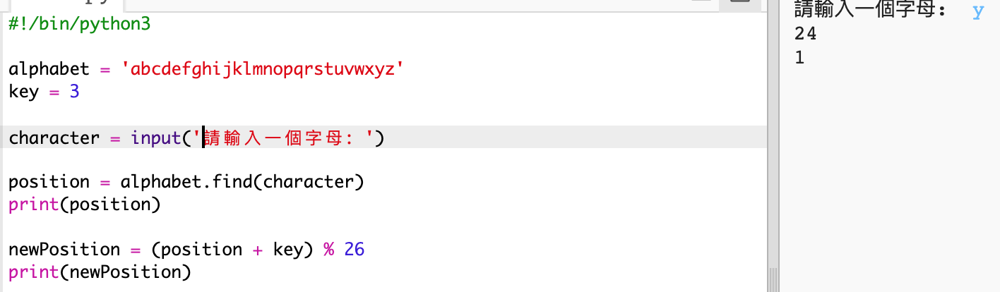
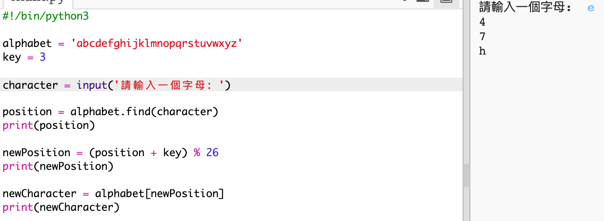
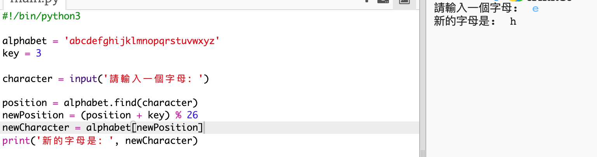

## 加密字母

讓我們編寫一個 Python 程式來加密一個單字元。

+ 打開空白的 Python 模板： <a href="http://jumpto.cc/python-new" target="_blank">jumpto.cc/python-new</a>。

+ 讓我們將字母表寫出來作為 `alphabet` 變數，而不是將其畫在圓中。
    
    

+ 讓我們幫字母表中每一個字母編次序， 從0開始， 以次序代表字母， 於是 a就是0， c就是2
    
    

+ 你在方括號內 填上位置， 便可取得 `alphabet` 的相應字母
    
    
    
    你在測試過之後就可以刪除 `print` 語句。

+ 接下來，你將需要在變數中儲存密鑰 `key`。
    
    

+ 然後，詢問使用者需要加密的字母（稱為 `character`變數）。
    
    

+ 找到字母（變數`character`）在字母表中的位置（變數`position`）。
    
    

+ 你可以將儲存在 `position`（位置）的字母列印出來以進行測試。例如，字元“e”位於字母表中的位置 4。
    
    

+ 要加密 `character`（字元），你需要向 `position`（位置）新增 `key`（密鑰）。它隨後會被儲存在 `newPosition` 變數中。
    
    

+ 新增程式碼來列印出新字元的位置。
    
    

+ 測試你的新程式碼。因為你的 `key`（密鑰）是 3，所以應該要把 `position`（位置）加上 3 並儲存在你的 `newPosition` 變數中。
    
    例如，字母“e”位於位置 4。為了進行加密，你需要加上 `key` (3)，得出 7。
    
    

+ 如果你試著加密字母“y”的話，會發生什麼事情呢？
    
    
    
    請注意 `newPosition` 現在變成 27，但是在字母表中並沒有 27 個字母！

+ 你可以使用 `%` 來告訴新位置，一旦到達位置 26，就返回位置 0。
    
    

+ 最後，你想要列印出新位置的字母。
    
    例如，向字母“e”新增密鑰得出 7，字母表中位置 7 的字母為“h”。
    
    

+ 試試你的程式碼。你還可以移除某些列印語句，只有在最後列印出新字元。
    
    