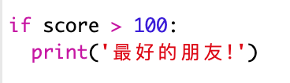

--- challenge ---

## 挑戰：友情計算器

編寫一個程式，通過計算友情得分，來顯示 2 人的關係有多密切。

該程式可迴圈遍歷 2 個名字中的每個字元，並在每次發現特定字母時向`score`（分數）變數新增分數。

你應決定獎勵分數的規則。例如，你可以對母音或者存在於“friend”這個詞中的字母獎勵分數：

你還可以根據得到的分數，給他們一條個人化的資訊：

--- /challenge ---

***
這個專案由以下志工翻譯：

何捷睿

王威翰

感謝志工們，我們才能為來自世界各地的人們提供學習機會。你也可以擔任翻譯志工，幫我們創造更多機會，若要進一步瞭解，請造訪 [rpf.io/translate](https://rpf.io/translate)。